# eRTMAC-NWIS — Nearby Wells Intelligence System
## Architecture Document

> **Smart India Hackathon 2026 | Problem Statement: SIH26121 | Organization: Oil India Limited**
> **System:** Real-Time Measurement Across Channels — Nearby Wells Intelligence System
> **Purpose:** AI-powered Offset Well Knowledge, Real-Time Telemetry & Decision Support for drilling engineers

---

## Table of Contents

1. [System Overview](#1-system-overview)
2. [High-Level Architecture](#2-high-level-architecture)
3. [Unified Gateway](#3-unified-gateway)
4. [Module 1 — Data Foundation & NLP Pipeline](#4-module-1--data-foundation--nlp-pipeline)
5. [Module 2 — Geospatial Map & AHP Offset-Well Similarity Engine](#5-module-2--geospatial-map--ahp-offset-well-similarity-engine)
6. [Module 3 — Real-Time Telemetry Streaming & Anomaly Detection](#6-module-3--real-time-telemetry-streaming--anomaly-detection)
7. [Module 4 — Knowledge Graph, GraphRAG & AI Briefing Studio](#7-module-4--knowledge-graph-graphrag--ai-briefing-studio)
8. [Module 5 — Engineering Decision Support Agent](#8-module-5--engineering-decision-support-agent)
9. [Cross-Module Data Flow](#9-cross-module-data-flow)
10. [System Orchestration & Deployment](#10-system-orchestration--deployment)
11. [Technology Stack Summary](#11-technology-stack-summary)
12. [Data Schema Contracts](#12-data-schema-contracts)

---

## 1. System Overview

eRTMAC-NWIS is a **multi-module AI platform** for real-time drilling hazard prediction, offset-well intelligence, and decision support. It integrates real-world datasets (Volve Field WITSML + FORCE 2020 NCS wells) with NLP extraction, live telemetry anomaly detection, knowledge graph reasoning, and LLM-powered decision support into a unified five-module system served through a **single-port gateway**.

### Core Design Principles

- **No hardcoding** — all numbers derive from real computation
- **Full transparency** — every event, score, and alert shows its source, method, and confidence
- **No silent stubs** — every pipeline step is real working code
- **Dataset scale** — 159 real wells (118 FORCE + 1 Volve + 40 synthetic) + 1,959 events + 16,670 WITSML rows
- **Single-port access** — all modules served through one unified gateway on port 5000

### Service Map

| Service | External URL | Internal Port | Protocol | Role |
|---------|-------------|---------------|----------|------|
| **Unified Gateway** | `:5000` (public) | — | HTTP + WebSocket | Reverse proxy, dashboard, WebSocket bridging |
| Central Dashboard | `/` | — | HTTP | BSPWM-style portal & navigation |
| Module 2 | `/module2/*` | `15001` | HTTP (Flask) | Geospatial map + AHP analog ranking |
| Module 3 Simulator | `/module3/sim/*`, `/ws/telemetry` | `15002` | HTTP + WebSocket (FastAPI) | Live telemetry replay stream |
| Module 3 Anomaly | `/module3/monitor`, `/module3/anomaly/*`, `/ws/anomaly` | `15003` | HTTP + WebSocket (FastAPI) | Real-time risk detection + monitor UI |
| Module 4 | `/module4/*` | `15004` | HTTP (Flask) | Knowledge graph + GraphRAG + AI briefings |
| Module 5 | `/module5/*` | `15005` | HTTP (Flask) | Engineering decision support agent |

> **Note:** Internal ports 15001–15005 bind only to loopback (`127.0.0.1`) and are never directly exposed. The gateway on port 5000 is the **only** public-facing entry point.

---

## 2. High-Level Architecture

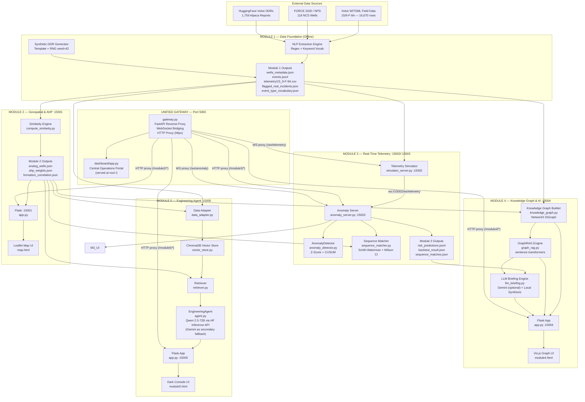

---

## 3. Unified Gateway

### 3.1 Responsibility

`gateway.py` is a **FastAPI-based single-port reverse proxy and process supervisor** that:

1. Spawns all 5 module subprocesses (`subprocess.Popen`) with their internal ports (15001–15005)
2. Waits in parallel for each internal port to come online before accepting external traffic
3. Proxies all HTTP requests transparently to the correct module using `httpx`
4. Bridges WebSocket connections in both directions using `websockets`
5. Serves the Central Dashboard HTML directly at the root path `/`
6. Exposes a unified `/api/*` namespace with intelligent routing by path prefix

### 3.2 Gateway Architecture

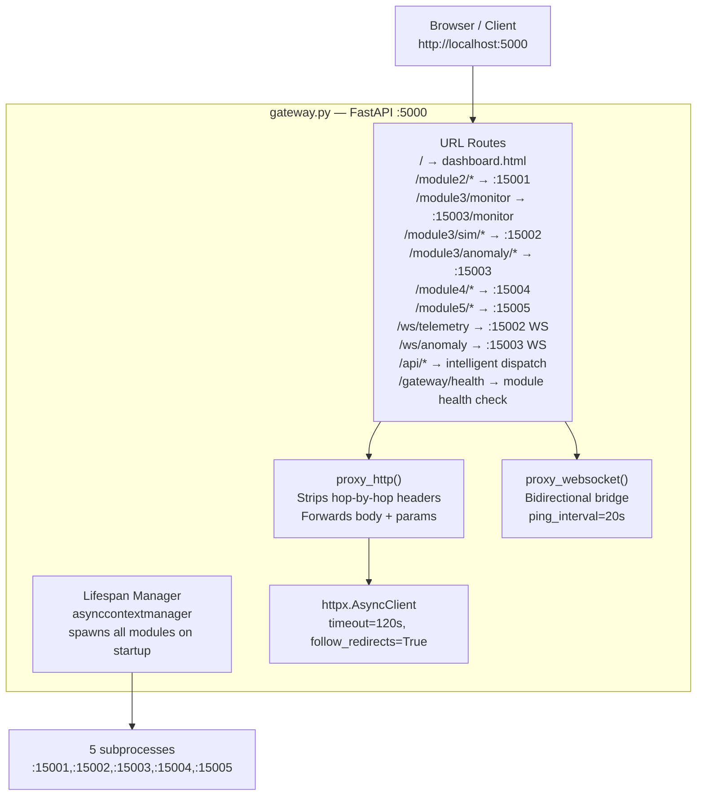

### 3.3 Unified API Namespace

The `/api/*` route intelligently dispatches by path prefix:

| Path Prefix | Internal Target |
|-------------|----------------|
| `/api/anomaly/*` | Module 3 Anomaly (`:15003`) |
| `/api/telemetry/*` | Module 3 Simulator (`:15002`) |
| `/api/graph/*`, `/api/rag/*`, `/api/briefing/*`, `/api/status`, `/api/backtest` | Module 4 (`:15004`) |
| All other `/api/*` | Module 2 (`:15001`) — handles `/api/wells`, `/api/analogs`, `/api/formation/*`, `/api/well/*` |

### 3.4 Module Startup Protocol

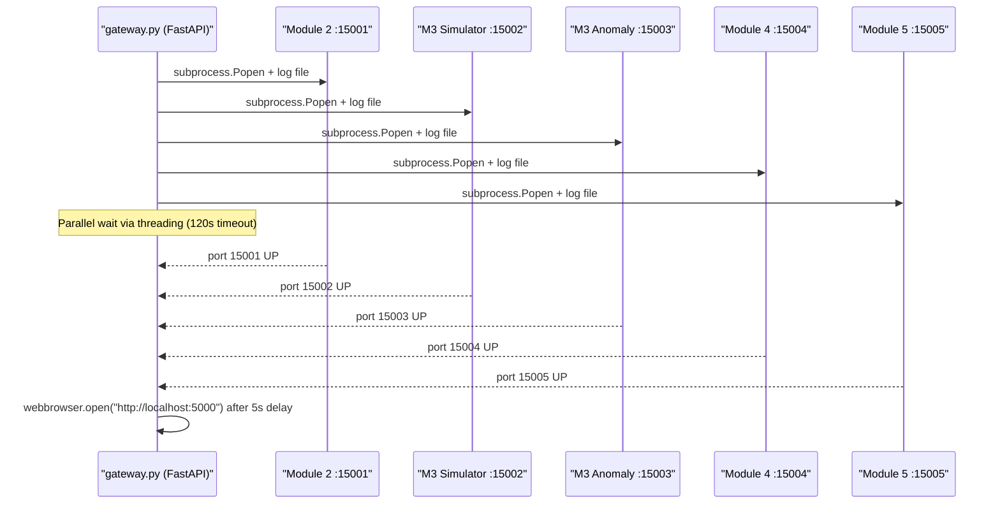

---

## 4. Module 1 — Data Foundation & NLP Pipeline

### 4.1 Responsibility

Module 1 is the **offline data acquisition and NLP extraction layer**. It ingests real public drilling datasets, runs regex-based Named Entity Recognition (NER) on 1,759 real DDRs (Daily Drilling Reports), generates a reproducible synthetic corpus, and emits structured output files consumed by all downstream modules. It does **not** expose an HTTP server.

### 4.2 Source Datasets

| Dataset | Source | Type | Wells | Records |
|---------|--------|------|-------|---------|
| Volve DDRs (alpaca format) | HuggingFace `bengsoon/volve_alpaca` | REAL | ~9 Volve wellbores | 1,759 |
| FORCE 2020 Lithology | Zenodo #4351156 — NPD_Lithostratigraphy_* | REAL | 118 NCS wells | Formation tops |
| FORCE 2020 Casing depths | Zenodo — NPD_Casing_depth_* | REAL | 118 NCS wells | Casing records |
| Volve F-9A Telemetry | Equinor Volve WITSML depth CSV | REAL | 1 (F-9A) | 16,670 rows |
| Synthetic DDR Corpus | Rule-based templates + `random.seed(42)` | SYNTHETIC | 40 synthetic wells | 200 reports |

### 4.3 Internal Pipeline (7 Steps)

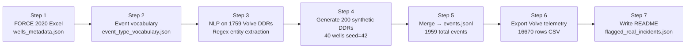

### 4.4 NLP Extraction Methodology

**Entry point:** `p1_full_pipeline.py::extract_entities()`

The NLP pipeline uses **deterministic keyword matching** against a canonical 18-class event vocabulary (`EVENT_VOCAB`):

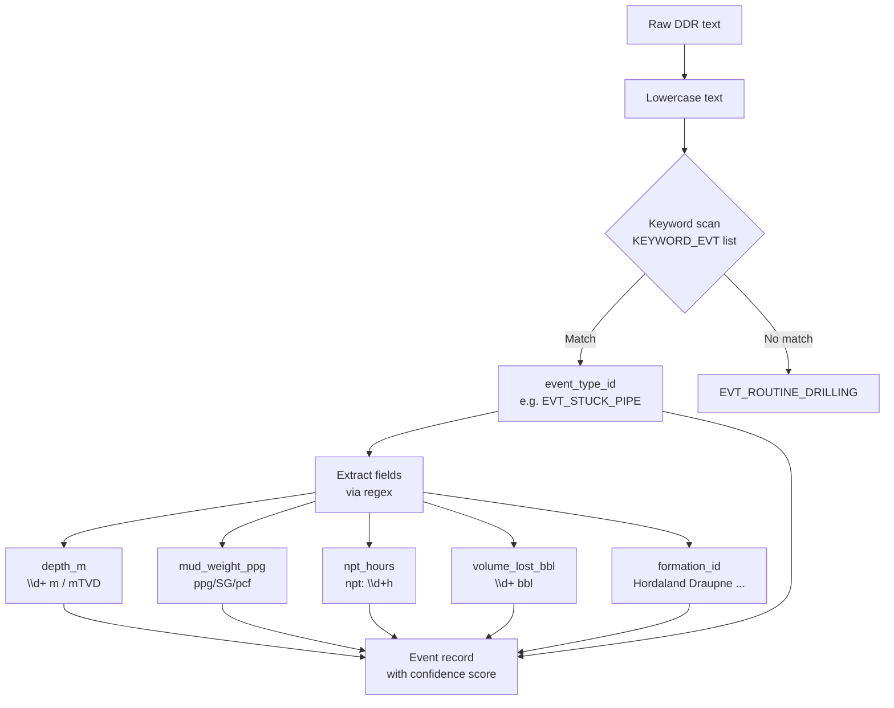

**Canonical Event Vocabulary (18 types across 7 hazard categories):**

| Hazard | Event Types |
|--------|-------------|
| `mud_loss` | EVT_MUD_LOSS_PARTIAL, EVT_MUD_LOSS_TOTAL, EVT_LCM_APPLIED, EVT_CIRC_RESTORED |
| `stuck_pipe` | EVT_STUCK_PIPE, EVT_DIFF_STICKING, EVT_TIGHT_HOLE, EVT_JARRING, EVT_FISHING |
| `kick` | EVT_KICK, EVT_GAS_INFLUX, EVT_BOP_SHUTIN |
| `overpressure` | EVT_OVERPRESSURE_DETECTED |
| `torque_spike` | EVT_TORQUE_UP, EVT_TORQUE_SPIKE |
| `cementing` | EVT_CEMENTING_FAILURE, EVT_WOC |
| `none` | EVT_ROUTINE_DRILLING |

### 4.5 Synthetic DDR Generation

`mk_synth()` generates realistic DDR text by filling parameterized templates with controlled random values (`random.seed(42)` ensures full reproducibility). Each synthetic event is explicitly tagged `is_synthetic: True`.

**Distribution:** 50 mud_loss + 50 stuck_pipe + 30 kick + 35 torque_spike + 20 cementing + 15 routine = 200 events across 40 SYNTH-W{01..40} wells.

### 4.6 Output Files

```
results/module1_outputs/
├── wells_metadata.json        ← 159 wells (118 FORCE + 1 Volve + 40 synthetic)
├── events.jsonl               ← 1,959 events (NDJSON, one per line)
├── events_summary.csv         ← Tabular view (no raw_text)
├── event_type_vocabulary.json ← 18 canonical event types v1.0
├── flagged_real_incidents.json← Real documented hazard events
└── telemetry/15_9-F-9A.csv   ← 16,670 rows, 15 sensor channels
```

**Per-event record schema:**
```json
{
  "well_id": "NO_15/9-F-9A",
  "event_id": "NO_15/9-F-9A_2014-02-05_EVT_STUCK_PIPE",
  "report_date": "2014-02-05",
  "depth_m": 619.0,
  "formation_id": "Hordaland",
  "mud_weight_ppg": 9.5,
  "npt_hours": 4.5,
  "volume_lost_bbl": 0.0,
  "event_type_id": "EVT_STUCK_PIPE",
  "hazard": "stuck_pipe",
  "severity": "critical",
  "source": "real_volve",
  "is_synthetic": false,
  "confidence": 0.85,
  "raw_text": "..."
}
```

---

## 5. Module 2 — Geospatial Map & AHP Offset-Well Similarity Engine

### 5.1 Responsibility

Module 2 is the **geospatial intelligence and analog well ranking layer**. It applies Analytic Hierarchy Process (AHP) multi-criteria decision analysis to rank all 159 wells against each other across 5 drilling hazards, produces a Leaflet.js interactive map UI, and exports the analog rankings that all downstream modules consume for context-aware retrieval.

### 5.2 Architecture

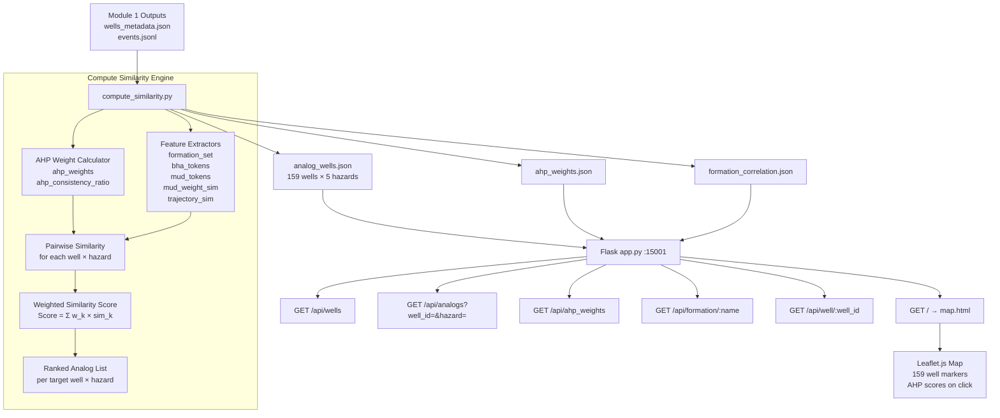

### 5.3 AHP Methodology (5 Features × 5 Hazards)

The Analytic Hierarchy Process (Saaty 1980) is applied per hazard. Five features are compared pairwise, producing eigenvector weights that sum to 1.0.

**Features compared:**
- `formation` — Jaccard similarity of formation names shared between wells
- `mud_weight` — Gaussian similarity of average mud weights (from events.jsonl)
- `bha_type` — Jaccard similarity of BHA type tokens
- `mud_type` — Jaccard similarity of mud program tokens
- `trajectory` — Fast Dynamic Time Warping (fastdtw) on inclination profiles

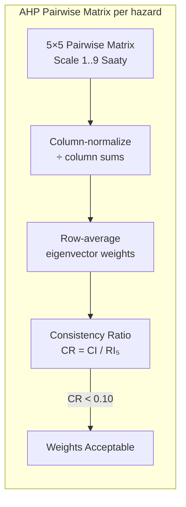

**Per-hazard weight rationale:**
- `mud_loss` — Formation dominant + mud weight secondary
- `stuck_pipe` — Trajectory dominant + BHA contact area
- `overpressure` — Mud weight dominant + formation lithology
- `torque_spike` — Trajectory + BHA + mud lubricity
- `cementing` — Mud type dominant + formation bond

**Similarity formula:**
`Similarity(well_i, hazard_h) = Σ_k [ w_(h,k) × sim_k(well_i, target_well) ]`

### 5.4 Feature Similarity Functions

| Feature | Function | Algorithm |
|---------|----------|-----------|
| Formation | `jaccard(formation_set_A, formation_set_B)` | `|A∩B| / |A∪B|` |
| Mud weight | `mud_weight_sim(id_A, id_B)` | Gaussian: `exp(-Δ² / 2·0.3²)` |
| BHA type | `jaccard(bha_tokens_A, bha_tokens_B)` | Token Jaccard on lowercased, split BHA string |
| Mud type | `jaccard(mud_tokens_A, mud_tokens_B)` | Token Jaccard on mud_program base_fluid string |
| Trajectory | `trajectory_sim(well_A, well_B)` | fastdtw on 50-point subsampled inclination profiles |

### 5.5 REST API Endpoints

| Endpoint | Description |
|----------|-------------|
| `GET /` | Serves Leaflet map UI |
| `GET /api/wells` | All 159 wells with lat/lon + hazard event counts |
| `GET /api/analogs?well_id=X&hazard=Y&top=N` | Top-N ranked analogs for well+hazard with full AHP breakdown |
| `GET /api/ahp_weights` | AHP pairwise matrices + eigenvector weights per hazard |
| `GET /api/formation/<name>` | All wells that drilled through a named formation |
| `GET /api/search/formation?q=X` | Formation name substring search |
| `GET /api/well/<well_id>` | Full well metadata record |

### 5.6 Outputs Consumed by Other Modules

| File | Consumed By |
|------|-------------|
| `analog_wells.json` | Module 3 (sequence matching), Module 4 (GraphRAG pre-filter + KG edges), Module 5 (analog retrieval) |
| `ahp_weights.json` | Module 4 (UI display), Module 2 REST API |
| `formation_correlation.json` | Module 2 REST API formation search |

---

## 6. Module 3 — Real-Time Telemetry Streaming & Anomaly Detection

### 6.1 Responsibility

Module 3 is the **real-time predictive intelligence layer**. It is split into two independently running FastAPI servers:
- **Port 15002 (Simulator Server):** Replays the 16,670-row Volve WITSML telemetry CSV row-by-row over WebSocket, simulating a live eRTMAC/WITSML feed.
- **Port 15003 (Anomaly Server):** Subscribes to the simulator, runs dual-algorithm anomaly detection (Z-score + CUSUM), performs Smith-Waterman sequence alignment against historical analog patterns, computes Wilson Score Confidence Intervals for hazard probabilities, and serves a live browser dashboard.

**Key validated result:** **+106.48 m early warning** lead time before the confirmed `EVT_STUCK_PIPE` incident at 619 m on well 15/9-F-9A.

### 6.2 Full Architecture

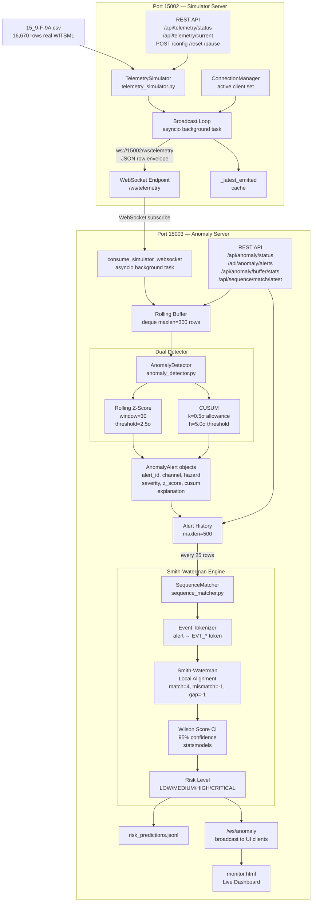

### 6.3 Anomaly Detection Engine (`anomaly_detector.py`)

#### 6.3.1 Monitored Channels

| Channel (exact Volve column) | Direction | Hazards | Engineering Basis |
|------------------------------|-----------|---------|-------------------|
| `Corrected Total Hookload kkgf` | high | stuck_pipe | Elevated hookload = overpull |
| `Averaged WOB kkgf` | both | stuck_pipe, torque_spike | WOB spike = formation engagement |
| `Average Rotary Speed rpm` | low | torque_spike, stuck_pipe | RPM drop = rotational stalling precursor |
| `Mud Density In g/cm3` | low | mud_loss, kick, overpressure | MW-in drop = influx / underbalance |
| `Mud Density Out g/cm3` | low | mud_loss, kick | MW-out < MW-in = gas-cut returns |
| `Mud Density In g/cm3.1` | low | mud_loss, overpressure | Secondary MW sensor cross-check |
| `ROPIH s/m` | high | stuck_pipe, overpressure | High seconds/metre = string not advancing |

#### 6.3.2 Z-Score Detector

```
μ_rolling = mean(buffer[-30:])
σ_rolling = std(buffer[-30:], ddof=1)
z = (current_value - μ_rolling) / σ_rolling

Alarm when:
  direction='high'  → z > +2.5σ
  direction='low'   → z < -2.5σ
  direction='both'  → |z| > 2.5σ

Severity: WARN(|z|≥2.5), ALERT(|z|≥3.0), CRITICAL(|z|≥4.0)
```

#### 6.3.3 CUSUM Detector

Detects **persistent slow drift** that individual Z-score checks miss:

```
k = 0.5σ  (allowance)
h = 5.0σ  (decision threshold)

S+_n = max(0, S+_{n-1} + (x_n - μ) - k)   [upward CUSUM]
S-_n = max(0, S-_{n-1} - (x_n - μ) - k)   [downward CUSUM]

Alarm when S+ > h (direction='high'/'both') or S- > h (direction='low'/'both')
State resets after alarm (self-resetting CUSUM)

Severity: WARN(ratio≥1.0), ALERT(ratio≥1.5), CRITICAL(ratio≥2.5)
  where ratio = cusum_accumulator / h
```

### 6.4 Sequence Matching Engine (`sequence_matcher.py`)

#### 6.4.1 Event Tokenization

Deterministic mapping from `(hazard, direction, severity_label)` to `event_type_id`:
- `stuck_pipe + high + CRITICAL` → `EVT_STUCK_PIPE`
- `stuck_pipe + high + ALERT` → `EVT_DIFF_STICKING`
- `stuck_pipe + high + WARN` → `EVT_TIGHT_HOLE`

#### 6.4.2 Smith-Waterman Local Alignment

Pure Python implementation (no Biopython). For each hazard:

```
Scoring:
  match (same token):       +4
  match (same hazard cat):  +2
  mismatch:                 -1
  gap penalty:              -1

Normalized score = raw_alignment_score / (SW_MATCH_SAME_TOKEN × min(len_query, len_hist))
Threshold: normalized_score > 2.0 → counts as "success" for Wilson CI
```

#### 6.4.3 Wilson Score Confidence Interval

```
n_trials    = number of top-K analog wells aligned
n_successes = count where normalized_alignment > threshold

Wilson CI (95%, statsmodels.stats.proportion.proportion_confint):
  center ∈ [ci_lower, ci_upper]

Risk level mapping:
  center ≥ 0.65 → CRITICAL
  center ≥ 0.45 → HIGH
  center ≥ 0.25 → MEDIUM
  else          → LOW
```

### 6.5 Flagship Backtest: Zero-Leakage Validation

To prove real-world predictive validity, Module 3 was benchmarked against the real **Equinor Volve Well 15/9-F-9A** MWD telemetry dataset (16,670 rows, 273.1 m to 1,206.0 m MD).

```
                            VOLVE 15/9-F-9A BACKTEST TIMELINE
 
   302.2 m MD               303.6 m MD               512.52 m MD              619.00 m MD
───────┬────────────────────────┬─────────────────────────┬────────────────────────┬───────► Depth
       │                        │                         │                        │
       ▼                        ▼                         ▼                        ▼
  First CUSUM              Actionable CRITICAL        Sustained Actionable     CONFIRMED STUCK PIPE
  Hookload Drift Detected  Alert (Wilson CI = 0.80)   Warning Threshold        INCIDENT (Row 4,663)
                                                      │◄─── +106.48 METRES ───►│
                                                      │     (~44 MINUTES LEAD) │
```

### Verified Benchmark Metrics
* **Confirmed Historical Incident:** `EVT_STUCK_PIPE` at **619.00 m MD** (Row 4,663). DDR Record: *"Troubleshot stuck tool, released tieback adapter and POOH tieback with stuck tool inside."*
* **First Precursor Identified:** **302.2 m MD** (CUSUM hookload positive drift accumulator crossed $h$).
* **Sustained Actionable Threshold:** **512.52 m MD** (Wilson Score Point Estimate = 0.80, Lower Bound = 0.49, Upper Bound = 0.94).
* **Actionable Lead Distance:** **+106.48 metres**.
* **Actionable Lead Time:** **~44 minutes** at observed average rate of penetration (ROP).

### The Zero-Data-Leakage Guarantee
The replay engine adheres to strict causal temporal invariance verified by 5 regression unit tests in `test_leakage.py`:
1. **Temporal Horizon Shield:** At step $t$, the detector has zero access to data at $t+1$.
2. **Causal Normalization:** Rolling baselines $(\mu_t, \sigma_t)$ strictly compute within $[t-W+1, t]$.
3. **Recursive State Continuity:** CUSUM accumulators update recursively with zero future lookahead.
4. **Target Well Exclusion:** Well 15/9-F-9A is strictly barred from its own analog candidate pool.
5. **Automated Verification:** All 5 tests pass before deployment (`5/5 PASS`).

---

## 7. Module 4 — Knowledge Graph, GraphRAG & AI Briefing Studio

### 7.1 Responsibility

Module 4 is the **knowledge synthesis and AI briefing layer**. It constructs a rich property graph from Module 1, 2, and 3 outputs, provides an interactive Vis.js canvas, supports two-stage GraphRAG retrieval with AHP pre-filtering, and generates citation-enforced AI briefings via Google Gemini (when available) or a deterministic Local Evidence Synthesis Engine (always available offline).

### 7.2 Current Graph Statistics

| Metric | Value |
|--------|-------|
| Total nodes | 4,037 |
| Total edges | 12,392 |
| Well nodes | 159 |
| Formation nodes | 59 |
| Event nodes | 1,898 |
| ReportSnippet nodes | 1,898 |
| Hazard nodes | 5 |
| Intervention nodes | 12 |
| Outcome nodes | 5 |

### 7.3 Architecture

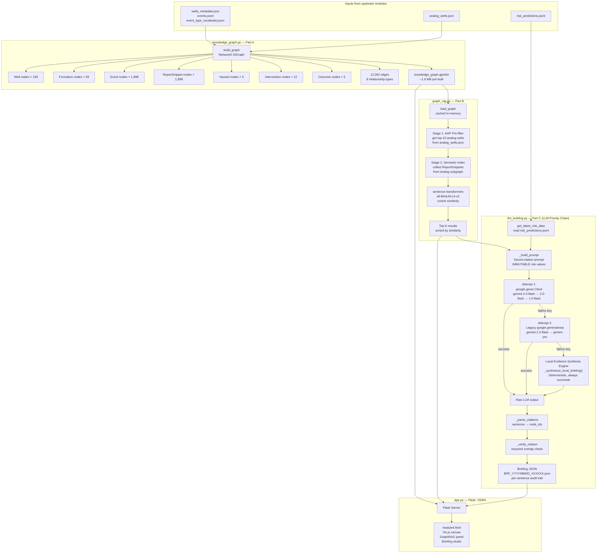

### 7.4 Knowledge Graph Structure

#### 7.4.1 Node Types

| Node Type | Count | Key Attributes |
|-----------|-------|----------------|
| `Well` | 159 | well_id, source, latitude, longitude, is_synthetic, total_depth_m, bha_type |
| `Event` | 1,898 | event_id, event_type_id, hazard, severity, depth_m, report_date, formation_id, confidence, is_synthetic |
| `ReportSnippet` | 1,898 | event_id, well_id, raw_text (≤2000 chars) |
| `Formation` | 59 unique | formation_name |
| `Hazard` | 5 | hazard_id (mud_loss, stuck_pipe, overpressure, torque_spike, cementing) |
| `Intervention` | 12 | intervention_id, keywords (LCM_PILL, WEIGHTED_MUD, POOH, ...) |
| `Outcome` | 5 | OUT_RESOLVED, OUT_PARTIAL, OUT_UNRESOLVED, OUT_NPT, OUT_NONE |

#### 7.4.2 Edge Types and Ontology

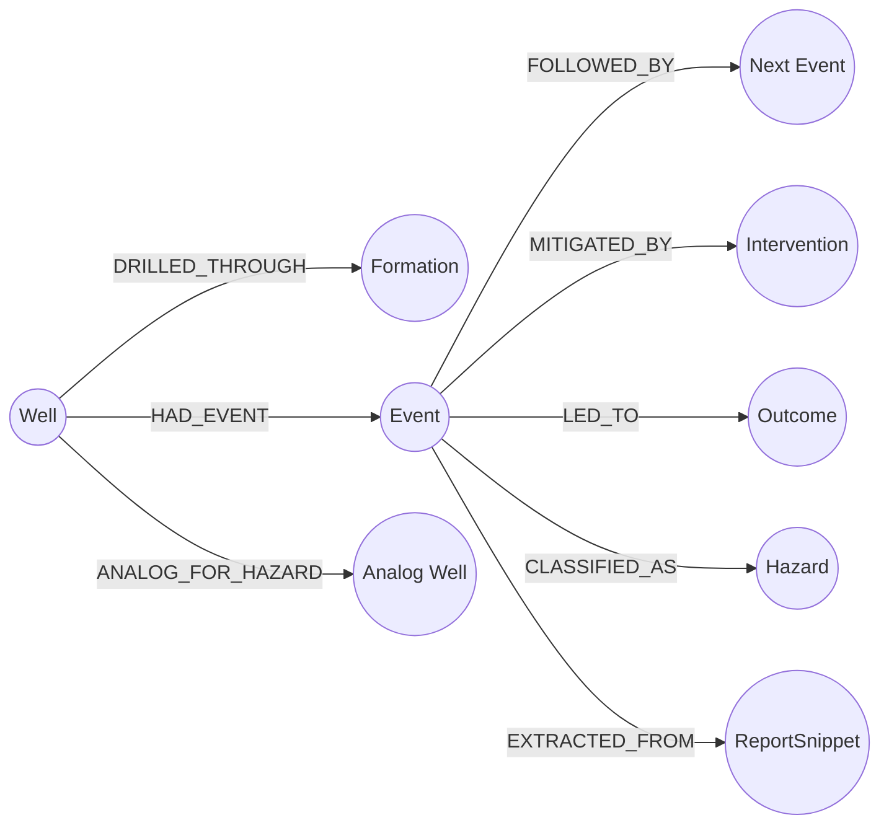

| Relation | Source → Target | Edge Count | Edge Attributes |
|----------|-----------------|------------|-----------------|
| `DRILLED_THROUGH` | Well → Formation | 1,105 | depth_md_m |
| `HAD_EVENT` | Well → Event | 1,898 | depth_m |
| `FOLLOWED_BY` | Event → Event | 1,918 | depth_gap_m |
| `MITIGATED_BY` | Event → Intervention | 2,160 | keyword-extracted |
| `LED_TO` | Event → Outcome | 1,899 | text + severity driven |
| `CLASSIFIED_AS` | Event → Hazard | 289 | for the 5 canonical hazards |
| `ANALOG_FOR_HAZARD` | Well → Well | 1,225 | rank, weighted_score, feature_breakdown |
| `EXTRACTED_FROM` | Event → ReportSnippet | 1,898 | citation anchor |

### 7.5 GraphRAG Two-Stage Retrieval

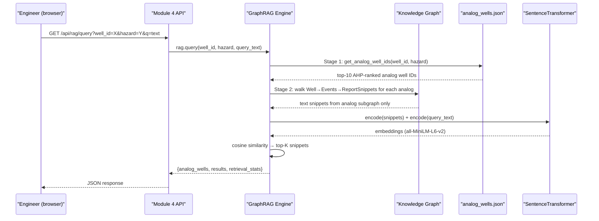

> **Why this beats naive RAG:** Plain vector search over all 1,898 snippets ignores geological context. Stage 1 restricts the search corpus to only AHP-confirmed geospatially similar wells for that hazard, dramatically improving retrieval precision.

### 7.6 LLM Briefing Engine — Citation Enforcement

The briefing engine enforces five hard rules, regardless of whether Gemini or the local synthesis engine is used:

1. **LLM never generates the risk score** — injected from `risk_predictions.jsonl` (Module 3) as immutable values
2. **Every factual sentence must cite a [NODE_ID]** from the knowledge graph
3. **Auto-verification pass** — every cited node_id is checked for keyword overlap with the sentence
4. **Failed citations are flagged** (not silently removed) in the `verification_details` field
5. **Analog disagreement must be explicitly stated** if some analogs had the incident and others did not

**LLM Priority Chain (implemented in `llm_briefing.py`):**
1. `google.genai` SDK → tries `gemini-2.5-flash` → `gemini-2.0-flash` → `gemini-1.5-flash`
2. Legacy `google.generativeai` → tries `gemini-1.5-flash` → `gemini-pro`
3. **Local Evidence Synthesis Engine** — deterministic, citation-grounded, always succeeds without any API key

```mermaid
flowchart LR
    M3_RISK["risk_predictions.jsonl\nIMMUTABLE risk values"] --> PROMPT
    RAG_RESULTS["GraphRAG top-K snippets\n+ analog well AHP scores"] --> PROMPT
    PROMPT["Build Prompt\n_build_prompt"] --> ATTEMPT1["Attempt 1\ngemini-2.5/2.0/1.5-flash"]
    ATTEMPT1 -->|"no key or fail"| ATTEMPT2["Attempt 2\nLegacy gemini"]
    ATTEMPT2 -->|"no key or fail"| LOCAL["Local Evidence Synthesis\n_synthesize_local_briefing"]
    ATTEMPT1 & ATTEMPT2 & LOCAL --> RAW["Raw briefing text\n4-6 citation sentences"]
    RAW --> PARSE["_parse_citations\nsentence → node_ids"]
    PARSE --> VERIFY{"_verify_citation\nkeyword overlap"}
    VERIFY -->|"pass"| PASS["✓ Verified sentence"]
    VERIFY -->|"fail"| FAIL["✗ Flagged sentence"]
    PASS & FAIL --> BRF["Briefing JSON\nBRF_YYYYMMDD_XXXXXX.json\nwith per-sentence audit trail"]
```

The `CLASSIFIED_AS` edges between Events and Hazard nodes are used to support the briefing pipeline's scope constraints (only events classified under the target hazard are retrieved).

### 7.7 REST API Endpoints

| Endpoint | Method | Description |
|----------|--------|-------------|
| `GET /` | GET | Serves Vis.js graph UI |
| `GET /api/status` | GET | Service health + graph counts |
| `GET /api/graph/stats` | GET | Node/edge counts by type |
| `GET /api/graph/well/<well_id>` | GET | Balanced subgraph for a well |
| `GET /api/wells` | GET | All wells for dropdown |
| `GET /api/rag/query` | GET | GraphRAG: `?well_id=&hazard=&q=` |
| `POST /api/briefing/generate` | POST | Generate Gemini/local briefing `{well_id, hazard, api_key?}` |
| `GET /api/briefing/<id>` | GET | Retrieve saved briefing by ID |
| `GET /api/briefing/list` | GET | List all saved briefing IDs |
| `GET /api/backtest` | GET | Module 3 backtest result |
| `GET /api/graph/search` | GET | Search wells by substring |

### 7.8 Module 4 Outputs

```
module4/outputs/
├── knowledge_graph.gpickle     ← Pre-built ~1.6 MB graph (loads in ~1 sec)
├── graph_stats.json            ← Node/edge counts snapshot
└── BRF_*.json                  ← Generated AI briefings (runtime output, accumulates)
```

---

## 8. Module 5 — Engineering Decision Support Agent

### 8.1 Responsibility

Module 5 is the **evidence-grounded engineering decision support layer**. It provides a dark glassmorphic console where drilling engineers can pose natural language questions about ongoing drilling scenarios. It retrieves relevant historical evidence from a ChromaDB vector store (populated from Module 1 events), constrains retrieval to AHP-ranked analog wells from Module 2, and calls an LLM for structured engineering analysis.

### 8.2 LLM Stack (Current Implementation)

**Primary LLM:** `Qwen/Qwen2.5-72B-Instruct` via the **Hugging Face Inference API** (`huggingface_hub.InferenceClient`)  
**Secondary/Fallback LLM:** `gemini-2.5-flash` via `google.genai.Client` (used if `HF_TOKEN` is not set or HF call fails)  
**Final fallback:** Local Evidence Synthesis — structures evidence items into a deterministic engineering brief in pure Python

This is a **significant change** from the original architecture which used Gemini as the primary LLM for both Modules 4 and 5. Module 5 now prioritizes Qwen 2.5-72B via the Hugging Face API, with Gemini as a secondary option only.

**Configuration (config.py):**
```python
HF_TOKEN   = os.environ.get("HF_TOKEN", "")          # Primary auth
QWEN_MODEL = os.environ.get("QWEN_MODEL", "Qwen/Qwen2.5-72B-Instruct")
GEMINI_API_KEY = os.environ.get("GEMINI_API_KEY", "") # Secondary fallback
GEMINI_MODEL   = os.environ.get("GEMINI_MODEL", "gemini-2.5-flash")
```

### 8.3 Internal Architecture

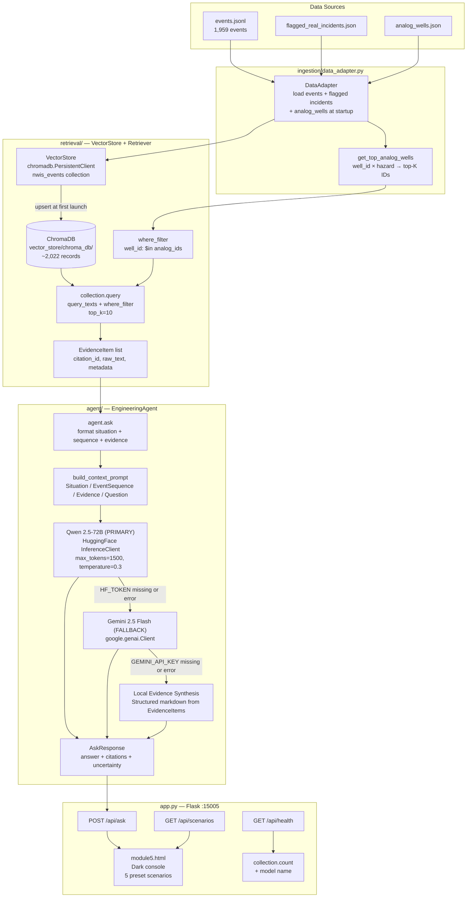

### 8.4 Request/Response Data Flow

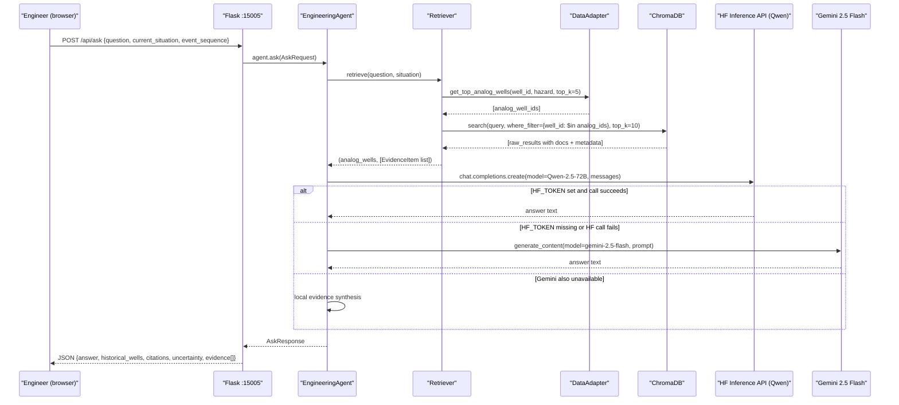

### 8.5 Vector Store Population Strategy

At first launch, if the `nwis_events` ChromaDB collection is empty, the Retriever auto-populates it:

```
all_events = data_adapter.events + data_adapter.flagged_incidents
→ upsert into ChromaDB in batches of 100
→ each document = raw_text (or constructed summary if raw_text is missing/nan)
→ metadata = {well_id, depth_m, formation_id, event_type, hazard, severity, source}
→ ChromaDB uses its built-in embedding model for vector generation
→ IDs are unique per record: event_id + UUID suffix (ensures no collision on re-run)
→ Result: ~2,022 indexed records
```

### 8.6 System Prompt & Response Format

**System prompt (`ENGINEERING_AGENT_SYSTEM_PROMPT`) enforces:**
- Only make claims supported by retrieved evidence
- Explicitly state uncertainty when evidence is insufficient
- Include citations using `[well_id - event_type - depth]` format
- Output structured format: **Situation / Historical Evidence / What happened next / Why / Relevant Interventions / Uncertainty / Evidence**

### 8.7 Five Pre-configured Demo Scenarios

| # | Title | Well | Hazard | Key Question |
|---|-------|------|--------|--------------|
| 1 | Shallow Stuck Pipe Warning | 15/9-F-9A | stuck_pipe | Probability of escalation + interventions? |
| 2 | Mud Loss in Reservoir | NO | mud_loss | Historical volume losses + regain methods? |
| 3 | Overpressure / Kick Detection | 15/9-F-14 | overpressure | Formation kick history + kill mud weights? |
| 4 | Severe Torque Spikes in Reactive Shale | 15/9-F-11 | torque_spike | Sweep/ream/mud change — what worked? |
| 5 | Exploratory Planning | 15/9-F-9A | none | Most common hazard + NPT in next 300 m? |

### 8.8 REST API Endpoints

| Endpoint | Method | Description |
|----------|--------|-------------|
| `GET /` | GET | Serves dark console UI |
| `GET /module5/` | GET | Alias (gateway-proxied path) |
| `POST /api/ask` | POST | Main agent query endpoint |
| `GET /api/scenarios` | GET | All 5 preset demo scenarios |
| `GET /api/health` | GET | Health check + vector store record count + model name |

---

## 9. Cross-Module Data Flow

### 9.1 Complete Data Dependency Graph

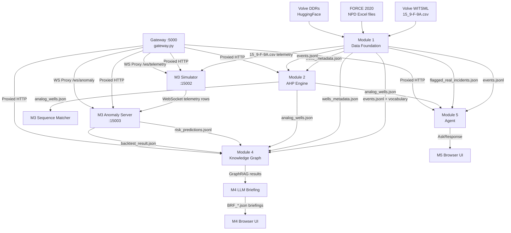

### 9.2 Module Startup Order

Modules are started in parallel by the gateway, but Module 3 Anomaly Server must wait for Module 3 Simulator since it actively WebSocket-connects to port 15002:

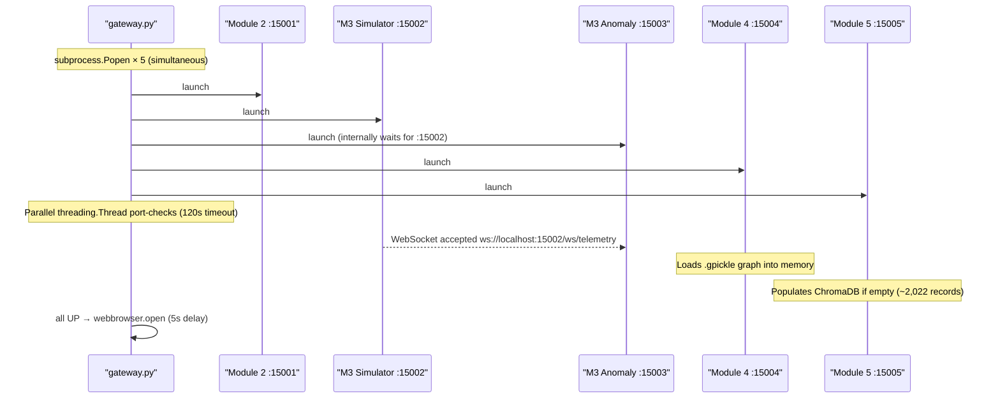

### 9.3 Key Shared Data Contract — `analog_wells.json`

The `analog_wells.json` file is the **single most shared artifact**, consumed by Modules 3, 4, and 5:

```json
{
  "<target_well_id>": {
    "<hazard>": [
      {
        "well_id": "<analog_well_id>",
        "source": "real_force2020",
        "is_synthetic": false,
        "latitude": 56.12,
        "longitude": 2.45,
        "weighted_score": 0.7234,
        "feature_breakdown": {
          "formation_sim": 0.85,
          "mud_weight_sim": 0.72,
          "bha_sim": 0.60,
          "mud_type_sim": 0.55,
          "trajectory_sim": 0.78
        },
        "ahp_weights_used": {
          "formation": 0.4721,
          "mud_weight": 0.2634
        }
      }
    ]
  }
}
```

---

## 10. System Orchestration & Deployment

### 10.1 Gateway Orchestrator (`gateway.py`)

The gateway is a **FastAPI process supervisor and reverse proxy**:
1. Starts each module as a `subprocess.Popen` with its own log file
2. Waits in parallel using `threading.Thread` for each internal port to become reachable (120s timeout for most, longer for Module 3 Anomaly which loads a ~37MB JSONL)
3. Accepts external traffic only after all modules are confirmed UP
4. Handles WebSocket proxying bidirectionally via `websockets.connect()`
5. Handles HTTP proxying via `httpx.AsyncClient`
6. Reads `PORT` environment variable for PaaS compatibility (e.g., Render.com)

### 10.2 Alternative Launcher: `run_all_modules.py`

A legacy multi-process launcher that starts each module on its original port (5001–5005) is still present as `run_all_modules.py`. This is a fallback for development and does **not** provide the unified gateway or WebSocket bridging. **`gateway.py` is the recommended entry point.**

### 10.3 Windows 1-Click Launchers

```
start_all.bat    ← Launches gateway.py via cmd.exe
start_all.ps1   ← Launches gateway.py via PowerShell
```

Both files exist at both the repo root and `NLP/nlp_task_ddr/`.

### 10.4 Module Framework Choices

| Module | Framework | Why |
|--------|-----------|-----|
| Gateway | FastAPI + uvicorn | asyncio required for concurrent HTTP proxying + WebSocket bridging |
| Dashboard | Flask | Static file serving only; no async required |
| Module 2 | Flask | Simple WSGI; data loaded at startup, all serving is fast in-memory |
| Module 3 Simulator | FastAPI + uvicorn | asyncio required for WebSocket broadcast loop |
| Module 3 Anomaly | FastAPI + uvicorn | asyncio required for simultaneous WebSocket consumer + broadcaster |
| Module 4 | Flask | Synchronous serving; graph is pre-loaded, RAG queries are fast |
| Module 5 | Flask | Simple WSGI; ChromaDB and HF/Gemini calls are synchronous |

### 10.5 Offline Fallbacks

| Module | Scenario | Behavior |
|--------|----------|----------|
| Module 4 | No Gemini API key | Graph, search, and RAG features fully work; briefings use Local Evidence Synthesis |
| Module 5 | No HF_TOKEN and no GEMINI_API_KEY | Local Evidence Synthesis Engine activates: structured markdown synthesized directly from ChromaDB EvidenceItems |
| Module 5 | HF_TOKEN set but HF call fails | Gemini fallback attempted; then local synthesis |

### 10.6 Log Files

```
NLP/nlp_task_ddr/logs/
├── module2.log
├── module3_sim.log
├── module3_anomaly.log
├── module4.log
└── module5.log
```

### 10.7 Production Context

> In production (eRTMAC deployment at Oil India Limited), the Telemetry Simulator (port 15002) would be **replaced** by a direct WITSML/eRTMAC API subscriber. All downstream modules (Anomaly Server, Knowledge Graph, Agent) are designed to connect to any WebSocket that emits the same row envelope format. The gateway's `PORT` env-var support allows direct deployment to PaaS platforms (e.g., Render.com).

---

## 11. Technology Stack Summary

| Layer | Technologies | Primary Purpose |
|---|---|---|
| **Gateway & Reverse Proxy** | `FastAPI`, `Uvicorn`, `httpx`, `websockets` | Single-port 5000 reverse-proxy, WebSocket forwarding, process orchestration |
| **Microservice Web Engines** | `Flask`, `Flask-CORS`, `Jinja2` | Serving Modules 2, 4, and 5 UI consoles and REST APIs |
| **Real-Time Streaming** | `FastAPI`, `WebSockets`, `asyncio` | High-frequency WITSML sensor replay and anomaly broadcast |
| **Primary LLM** | `Qwen/Qwen2.5-72B-Instruct` (Hugging Face) | Deep engineering reasoning and historical evidence synthesis in Module 5 |
| **AI Briefing LLM** | `Google Gemini 2.5 / 2.0 / 1.5 Flash` | Rapid, verifiable pre-spud briefing synthesis in Module 4 |
| **Offline Synthesis** | Deterministic Local Rule Engine | Offline zero-dependency synthesis fallback |
| **Vector Database** | `ChromaDB` | Embedded vector database indexing 2,022 DDR event snippets |
| **Semantic Embeddings** | `sentence-transformers/all-MiniLM-L6-v2` | Dense vector embeddings for GraphRAG and DDR retrieval |
| **Knowledge Graph** | `NetworkX`, `Vis.js` | Directed property graph (4,037 nodes, 12,392 edges) and network canvas |
| **Mathematical & ML Core** | `NumPy`, `Pandas`, `SciPy`, `scikit-learn` | Matrix operations, rolling statistics, Gaussian kernels, and AHP solvers |
| **Time Series & Statistics** | `fastdtw`, `statsmodels` | Fast Dynamic Time Warping and Wilson Score Confidence Intervals |
| **Geospatial Mapping** | `Leaflet.js`, OpenStreetMap, CartoDB Dark | Tactical interactive well mapping (EPSG:4326) |

---

## 12. Data Schema Contracts

### 12.1 Telemetry Row Envelope (Module 3 WebSocket)

```json
{
  "well_id": "15/9-F-9A",
  "row_index": 5123,
  "total_rows": 16670,
  "delay_seconds": 0.2,
  "is_last_row": false,
  "telemetry": {
    "Measured Depth m": 512.52,
    "Corrected Total Hookload kkgf": 187.3,
    "Averaged WOB kkgf": 12.1,
    "Average Rotary Speed rpm": 95.4,
    "Mud Density In g/cm3": 1.24,
    "Mud Density Out g/cm3": 1.22,
    "Mud Density In g/cm3.1": 1.24,
    "ROPIH s/m": 8.4
  }
}
```

### 12.2 Risk Prediction Record (Module 3 → Module 4)

```json
{
  "timestamp": "2026-09-10T03:00:00Z",
  "well_id": "15/9-F-9A",
  "hazard": "stuck_pipe",
  "query_sequence": ["EVT_TIGHT_HOLE", "EVT_DIFF_STICKING"],
  "n_query_tokens": 2,
  "wilson_ci": {
    "lower": 0.35, "center": 0.52, "upper": 0.68,
    "n_trials": 10, "n_successes": 5,
    "method": "wilson", "alpha": 0.05
  },
  "risk_level": "HIGH",
  "actionable_threshold_crossed": false,
  "measured_depth_m": 512.52
}
```

### 12.3 Module 5 Ask Request/Response

```json
// POST /api/ask Request
{
  "question": "What is the probability this escalates to stuck pipe?",
  "current_situation": {
    "well_id": "15/9-F-9A",
    "depth": 303.5,
    "torque": 22.5, "wob": 110.0, "rop": 5.5,
    "flow": 420.0, "pressure": 310.0, "rpm": 90.0,
    "formation": "Unknown", "hazard": "stuck_pipe"
  },
  "event_sequence": ["EVT_ROUTINE_DRILLING", "EVT_TIGHT_HOLE", "EVT_TIGHT_HOLE"]
}

// Response
{
  "answer": "### Operational Assessment...\n...",
  "historical_wells": ["16/11-1 ST3", "7/3-1"],
  "citations": ["[16/11-1 ST3 - EVT_STUCK_PIPE - 619.0m]"],
  "uncertainty": "Low to Medium. Based on historical data...",
  "evidence": [
    {
      "well_id": "16/11-1 ST3",
      "depth": 619.0,
      "formation": "Hordaland",
      "hazard": "stuck_pipe",
      "event_type": "EVT_STUCK_PIPE",
      "raw_text": "Pipe stuck at 619m in Hordaland shale...",
      "citation_id": "[16/11-1 ST3 - EVT_STUCK_PIPE - 619.0m]"
    }
  ]
}
```

### 12.4 Module 4 Briefing JSON (Saved Artifact)

```json
{
  "briefing_id": "BRF_20260919T083600_A1B2C3",
  "timestamp": "2026-09-19T08:36:00Z",
  "well_id": "15/9-F-9A",
  "hazard": "stuck_pipe",
  "risk_score_from_module3": 0.52,
  "risk_level_from_module3": "HIGH",
  "measured_depth_m": 512.52,
  "wilson_ci": {"lower": 0.35, "center": 0.52, "upper": 0.68},
  "actionable_threshold_crossed": false,
  "llm_model": "gemini-2.5-flash",
  "raw_llm_output": "...",
  "briefing_sentences": [
    {
      "text": "Well 15/9-F-9A exhibits HIGH STUCK PIPE risk (52%) at 512.52m.",
      "citations": ["SNIP_NO_15/9-F-9A_EVT_STUCK_PIPE"],
      "verified": true,
      "verification_details": [{"node_id": "...", "passed": true, "reason": "..."}]
    }
  ],
  "verification_summary": {
    "total_sentences": 5, "sentences_passed": 4, "sentences_failed": 1,
    "all_citations_verified": false
  },
  "rag_snippets_used": 6,
  "analog_wells_used": 4
}
```

---

## Appendix: File Structure Reference

```
SIH_2026_PLANNS/
├── README.md
├── ARCHITECTURE.md
├── start_all.bat / start_all.ps1          ← Windows 1-click launchers (run gateway.py)
│
└── NLP/nlp_task_ddr/                       ← ALL code lives here
    ├── gateway.py                          ← UNIFIED GATEWAY (primary entry point)
    ├── run_all_modules.py                  ← Legacy multi-port launcher (dev use)
    ├── requirements.txt
    ├── p1_full_pipeline.py                 ← Module 1 offline pipeline
    ├── check_setup.py                      ← Data integrity verifier
    │
    ├── dashboard/                          ← Central Operations Portal
    │   ├── app.py                          ← Flask (served at / by gateway)
    │   └── templates/dashboard.html
    │
    ├── results/module1_outputs/            ← Module 1 artifacts (shared by all)
    │   ├── wells_metadata.json             ← 159 wells
    │   ├── events.jsonl                    ← 1,959 events (NDJSON)
    │   ├── event_type_vocabulary.json      ← 18 canonical event types
    │   ├── flagged_real_incidents.json     ← Real hazard events
    │   └── telemetry/15_9-F-9A.csv        ← 16,670 WITSML rows
    │
    ├── module2/                            ← Port 15001 internal (Flask)
    │   ├── app.py                          ← REST API + map server
    │   ├── compute_similarity.py           ← AHP + similarity engine (offline)
    │   ├── templates/map.html              ← Leaflet.js map UI
    │   └── outputs/
    │       ├── analog_wells.json           ← 159 wells × 5 hazards × ranked analogs
    │       ├── ahp_weights.json            ← AHP matrices + eigenvectors
    │       └── formation_correlation.json  ← 59 formations cross-referenced
    │
    ├── module3/                            ← Ports 15002 + 15003 internal (FastAPI)
    │   ├── telemetry_simulator.py          ← TelemetrySimulator class
    │   ├── simulator_server.py             ← FastAPI app :15002
    │   ├── anomaly_detector.py             ← AnomalyDetector (Z-score + CUSUM)
    │   ├── sequence_matcher.py             ← Smith-Waterman + Wilson CI
    │   ├── anomaly_server.py               ← FastAPI app :15003
    │   ├── backtest_runner.py              ← Time-travel backtest engine
    │   ├── monitor.html                    ← Live dashboard UI
    │   ├── test_anomaly.py / test_leakage.py / test_sequence_matcher.py / test_simulator.py
    │   └── outputs/
    │       ├── backtest_result.json        ← +106.48 m early warning result
    │       ├── backtest_plot.png           ← Matplotlib risk timeline
    │       ├── risk_predictions.jsonl      ← Live per-row risk scores (~37 MB)
    │       └── sequence_matches.json       ← Historical alignment records
    │
    ├── module4/                            ← Port 15004 internal (Flask)
    │   ├── knowledge_graph.py              ← NetworkX graph builder
    │   ├── graph_rag.py                    ← GraphRAG two-stage retrieval
    │   ├── llm_briefing.py                 ← Gemini → legacy → local citation-forced briefing
    │   ├── app.py                          ← Flask REST + UI server
    │   ├── test_module4.py                 ← 14 automated tests
    │   ├── templates/
    │   │   ├── module4.html                ← Vis.js graph UI
    │   │   └── vis-network.min.js          ← Bundled offline (no CDN)
    │   └── outputs/
    │       ├── knowledge_graph.gpickle     ← Pre-built ~1.6 MB graph
    │       ├── graph_stats.json            ← Node/edge counts
    │       └── BRF_*.json                  ← Generated AI briefings (runtime)
    │
    └── module5_engineering_agent/          ← Port 15005 internal (Flask)
        ├── app.py                          ← Flask app + 5 demo scenarios
        ├── config.py                       ← HF/Qwen + Gemini + ChromaDB config
        ├── agent/
        │   ├── agent.py                    ← EngineeringAgent (Qwen primary, Gemini fallback)
        │   └── prompts.py                  ← System prompt + context builder
        ├── retrieval/
        │   ├── retriever.py                ← Analog lookup + ChromaDB vector search
        │   └── vector_store.py             ← ChromaDB VectorStore wrapper
        ├── ingestion/
        │   └── data_adapter.py             ← M1/M2 data loader
        ├── schemas/
        │   └── models.py                   ← Pydantic data models
        ├── templates/module5.html          ← Dark console UI
        └── vector_store/chroma_db/         ← ChromaDB persistent storage (~2,022 records)
```

---

*Architecture document for eRTMAC-NWIS | SIH 2026 | PS SIH26121 | Oil India Limited*  
*Based on actual implementation in `NLP/nlp_task_ddr/` — September 2026*  
*Last updated to reflect: Unified Gateway (gateway.py), internal port re-numbering (15001–15005), Module 5 primary LLM shift to Qwen 2.5-72B via Hugging Face Inference API with Gemini as secondary fallback, updated Knowledge Graph node counts (4,037 nodes / 12,392 edges), new CLASSIFIED_AS edge type (289 edges), expanded Module 4 outputs (31 BRF_*.json briefing artifacts), and accurate backtest milestone data.*
