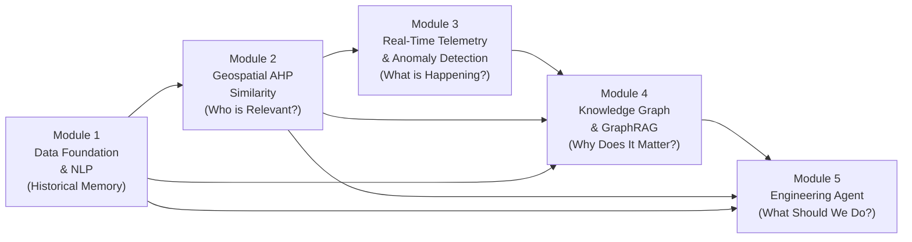
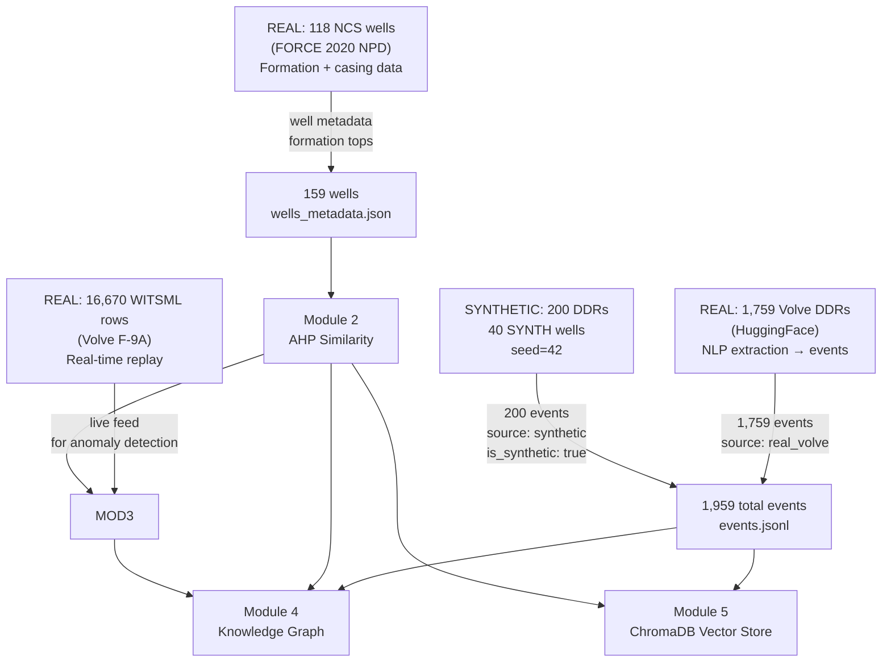

# eRTMAC-NWIS — Project Research & Conceptual Foundation

> **Smart India Hackathon 2026 | Problem Statement: SIH26121 | Organization: Oil India Limited**
> **System:** Real-Time Measurement Across Channels — Nearby Wells Intelligence System

---

## Table of Contents

1. [Background and Problem Context](#1-background-and-problem-context)
2. [Why This Problem Is Technically and Operationally Difficult](#2-why-this-problem-is-technically-and-operationally-difficult)
3. [Real-World Nuances and Field-Level Challenges](#3-real-world-nuances-and-field-level-challenges)
4. [Consequences and Impact of the Problem](#4-consequences-and-impact-of-the-problem)
5. [Existing Approaches and Their Limitations](#5-existing-approaches-and-their-limitations)
6. [Motivation Behind Our Proposed Solution](#6-motivation-behind-our-proposed-solution)
7. [Overall Conceptual Approach](#7-overall-conceptual-approach)
8. [Data Sources — Selection, Rationale, and Limitations](#8-data-sources--selection-rationale-and-limitations)
9. [Theoretical and Research Foundations](#9-theoretical-and-research-foundations)
10. [Practical Applicability in a Real eRTMAC / Oil India Environment](#10-practical-applicability-in-a-real-ertmac--oil-india-environment)
11. [Expected Impact and Benefits](#11-expected-impact-and-benefits)
12. [Limitations, Assumptions, and Current Constraints](#12-limitations-assumptions-and-current-constraints)
13. [Gap Between Prototype and Production Deployment](#13-gap-between-prototype-and-production-deployment)
14. [Potential Future Extensions](#14-potential-future-extensions)

---

## 1. Background and Problem Context

### 1.1 Oil Drilling Operations: A Complex, High-Stakes Environment

Oil and gas wells are drilled by rotating a drill string — a connected assembly of steel pipe, a bottom-hole assembly (BHA), and a drill bit — through thousands of meters of rock. The drill string transmits rotation, weight, and hydraulic energy to the bit, while drilling fluid ("mud") is continuously pumped down the string, out through the bit nozzles to cool and clean the cutting face, and back up the annular space to surface, carrying rock cuttings.

Every meter of hole drilled passes through varying formations of rock, each with its own pressure regime, permeability, temperature, and mechanical strength. Engineers must anticipate, detect, and respond to hazards that arise when the drill string encounters unexpected geological or mechanical conditions. Among the most consequential hazards are:

- **Stuck pipe** — The drill string becomes immobilized in the wellbore, either mechanically (key seating, pack-off) or due to differential pressure sticking in permeable formations. This is one of the most costly drilling incidents in the industry.
- **Mud loss / Lost circulation** — Drilling fluid is lost into the formation (through fractures or permeable zones) at a rate exceeding the ability to maintain wellbore pressure. This can destabilize the well and lead to loss of well control.
- **Kicks and well control events** — Formation fluids (oil, gas, water) at unexpectedly high pressure invade the wellbore, requiring blowout preventer (BOP) activation and active well kill operations.
- **Overpressure** — Unexpected geopressure zones where formation pressure exceeds the planned mud weight window, creating a risk of wellbore instability or uncontrolled influx.
- **Torque and drag** — Excessive rotational friction (torque) or axial friction (drag), often a precursor to more severe events like packoff or stuck pipe, especially in reactive shale formations.
- **Cementing failures** — Poor cement bonding during casing cementing operations, which can compromise well integrity and zonal isolation.

### 1.2 The eRTMAC System — Oil India Limited's Real-Time Monitoring Infrastructure

**eRTMAC** (Enhanced Real-Time Measurement Across Channels) is Oil India Limited's proprietary real-time drilling operations center. It streams live sensor data from active drilling rigs — including weight-on-bit, rate-of-penetration, standpipe pressure, torque, rotary speed, mud flow rates, and mud density measurements — to a centralized monitoring platform. This data is observed by drilling engineers around the clock.

eRTMAC represents a significant investment in digital infrastructure. It gives engineers visibility into what is happening at the drill bit in near-real-time. However, **visibility alone is insufficient** — the critical question is not just "what is happening now?" but "what does this pattern of events mean, and what happened to other wells in similar situations?"

### 1.3 The Problem Statement (SIH 2026 PS SIH26121)

Oil India Limited articulated the following operational problem:

> *Current well monitoring systems provide real-time sensor data but lack the ability to correlate ongoing drilling conditions with historical incidents from nearby or geologically similar offset wells. Drilling engineers must rely on personal experience and ad-hoc consultation to interpret abnormal readings, with no automated system for matching current conditions against documented historical hazard events. This leads to delayed hazard recognition, reactive rather than proactive responses, and the repeated loss of institutional knowledge when experienced engineers retire or transfer.*

In essence, there is a **gap between the availability of real-time telemetry and the ability to contextualize that data against historical institutional knowledge.** The problem has three interlocking dimensions:

1. **Knowledge fragmentation** — Decades of drilling experience are locked in unstructured daily drilling reports (DDRs), well completion reports, and personal memories. There is no searchable, structured, cross-well database of what happened, at what depth, in what formation, and what was done about it.

2. **Pattern recognition at scale** — Even if data exists, no human can simultaneously monitor live telemetry across multiple channels while cross-referencing hundreds of historical wells in real time.

3. **Decision latency** — By the time an anomaly is recognized, interpreted, and a decision made, the window for early intervention is often lost.

---

## 2. Why This Problem Is Technically and Operationally Difficult

### 2.1 The Unstructured Nature of Historical Drilling Knowledge

The richest source of institutional drilling knowledge is the **Daily Drilling Report (DDR)** — a narrative document written every 24 hours by the on-site drilling engineer. DDRs describe what operations were performed, what depth was reached, what problems occurred, and how they were resolved. They contain irreplaceable operational intelligence: the exact sequence of events before a stuck pipe event, the mud weight that triggered a kick, the formation that caused severe mud losses.

DDRs are, however, purely unstructured natural language text. They contain:
- Domain-specific terminology that varies by operator, region, and era
- Mixed measurement units (ppg, SG, bar, psi, kgf)
- Implicit causal relationships that must be inferred
- Abbreviations and non-standard field shorthand
- Incident descriptions buried within routine operations summaries

Extracting structured, queryable events from DDRs requires domain-specific NLP — standard off-the-shelf information extraction tools fail on this text because they lack drilling domain vocabulary and the domain rules needed to interpret the specialized language.

### 2.2 The Heterogeneity of Drilling Data

Drilling datasets come from multiple, incompatible sources: WITSML feeds (an XML-based industry standard for real-time drilling data), Excel logs, PDF reports, proprietary operator databases, and SCADA systems. Each source has different schemas, sampling rates, units, and quality levels. Even within the same operator's dataset, conventions change over time.

The real-time telemetry feed from a WITSML source contains measurements that must be interpreted in the context of what drilling operation is currently being performed (drilling ahead, tripping pipe, running casing, circulating). An anomalous hookload reading means something entirely different during drilling versus a trip out of hole.

### 2.3 Geological Variability and the Challenge of "Offset Well" Relevance

The concept of an "offset well" or "analog well" is central to drilling risk assessment: if a similar incident happened in a nearby well drilled through the same formation, that history is directly relevant to the current well. However, "similarity" between wells is inherently multi-dimensional:

- **Geographic proximity** is necessary but not sufficient — nearby wells may drill into different structures at different depths
- **Formation similarity** is required — the same formation name at different depths or pressure regimes may behave very differently
- **Wellbore geometry** matters — a vertical well and a deviated well through the same formation will have different friction and torque profiles
- **Mud program** matters — the same formation drilled with oil-based versus water-based mud will behave differently
- **Operational context** matters — the same formation drilled at different mud weights (ECD) carries different risks

Quantifying multi-dimensional geological and operational similarity in a principled, transparent, auditable way is a non-trivial problem. Naive geographic distance or single-feature matching produces unreliable analog rankings.

### 2.4 The Temporal Nature of Drilling Hazards

Drilling hazards rarely manifest instantaneously. They develop through a sequence of precursor events: a stuck pipe incident is typically preceded by tight hole indicators (increased overpull on connections), elevated torque, and reduced penetration rate over many meters of drilling. Recognizing this temporal sequence — and distinguishing it from normal operational variation — requires time-series analysis of multiple channels simultaneously.

Classical alert thresholds (e.g., "alert when WOB exceeds X") are too simplistic because:
- Normal operational ranges vary with formation, depth, and BHA configuration
- Single-channel thresholds generate excessive false alarms
- Slow drift trends (a CUSUM-type pattern) are as dangerous as sudden spikes but harder to detect with threshold logic
- The meaningful signal is often in the **joint behavior** of multiple channels over time, not any single channel in isolation

### 2.5 The Problem of Actionable Warning Lead Time

Even when a hazard precursor is detected, the key operational question is whether the detection is early enough to act. A warning that arrives simultaneously with the stuck pipe event itself has no operational value. A warning 100+ meters before the incident — while there is still time to change drilling parameters, pump sweeps, or pull out of hole — can prevent the event entirely.

Demonstrating that a detection system provides genuinely actionable lead time requires a rigorous, causality-preserving backtest methodology that does not use future data at any point in the computation (no data leakage).

---

## 3. Real-World Nuances and Field-Level Challenges

### 3.1 Who Uses This System and When

The primary users of eRTMAC-NWIS are **on-site and remote drilling engineers** who are simultaneously monitoring live rig operations. They cannot pause a drilling operation to consult a complex system. The decision support interface must deliver information in a format that is immediately actionable — structured, direct, citation-grounded, and not verbose. "What happened before in similar wells, and what was done about it?" is the exact form of question that needs to be answered in seconds.

### 3.2 The Problem of Non-Productive Time (NPT)

Non-Productive Time (NPT) is time spent on the rig where no progress is being made toward well objectives. In the oil and gas industry globally, NPT accounts for an estimated **15–25% of total well costs**. For a well costing $50–100 million, this translates to $7–25 million in avoidable expenditure per well. Stuck pipe and well control events are among the leading causes of NPT globally.

The practical implication: even a modest improvement in early hazard recognition — moving the warning from 30 meters to 106 meters before an event, as demonstrated by this system's backtest — can mean the difference between a correctable situation and a multi-day stuck pipe recovery operation.

### 3.3 The Knowledge Retention Crisis

The oil and gas industry is experiencing a demographic shift where a large proportion of experienced engineers with 20–35 years of operational knowledge are retiring over the next decade. The institutional knowledge in their heads — the patterns they recognize intuitively, the situations they have navigated before, the tricks that worked in specific formations — is largely undocumented. DDRs represent the closest approximation to structured documentation of this knowledge, but they are rarely indexed, rarely searched, and frequently inaccessible across organizational boundaries.

### 3.4 The "Adjacent Possible" Problem in Hazard Detection

A stuck pipe event does not announce itself. What actually happens is a gradual narrowing of the operational window — tight hole on connections, slightly elevated torque, reduced string weight when rotating — followed by a decisive moment where the string stops rotating or moving. Each individual indicator could have an innocent explanation. It is the pattern, the sequence, and the comparison against what preceded similar events in historical wells that transforms ambiguous signals into actionable warnings.

---

## 4. Consequences and Impact of the Problem

### 4.1 Direct Operational and Financial Consequences

| Hazard Type | Typical NPT | Typical Direct Cost | Indirect Consequences |
|-------------|-------------|--------------------|-----------------------|
| Stuck pipe (minor, freed by jarring) | 6–24 hours | $100K–$500K | Hole cleaning issues, formation damage |
| Stuck pipe (fishing required) | 1–14 days | $1M–$10M+ | Sidetrack well may be required |
| Lost circulation (partial) | 4–48 hours | $50K–$500K | Mud costs, wellbore instability |
| Lost circulation (total, severe) | 1–7 days | $500K–$5M+ | Casing, cementing problems, well loss |
| Kick (minor, controlled) | 2–12 hours | $50K–$200K | Delay, mud reconditioning |
| Blowout (loss of well control) | Weeks–months | $10M–$1B+ | Environmental, safety, regulatory |

### 4.2 Safety Consequences

The most severe drilling hazards have direct safety implications. A well control event that escalates to a blowout puts rig crew at risk of fire, explosion, and injury. Stuck pipe incidents put personnel at risk when they must work on the drill floor during recovery operations. Cementing failures can compromise long-term well integrity, creating environmental and safety risks that persist for the life of the well.

Early recognition of escalating hazard patterns is not only a financial concern — it is a **personnel safety concern**.

### 4.3 Consequence for Decision-Making Quality

When engineers must make real-time decisions under uncertainty without access to historical context, they are forced to rely solely on personal experience. This introduces several failure modes:

- **Availability bias** — Engineers tend to recall incidents they personally experienced, not the full statistical range of what has occurred
- **Recency bias** — Recent incidents are weighted more heavily than older ones that may be more relevant
- **Expert-dependency** — Critical decisions require calling the most experienced engineer, who may be unavailable
- **Inconsistency** — Different engineers make systematically different decisions for identical situations based on their individual experience

A system that provides structured historical evidence directly to the decision-maker creates a more level field and reduces variance in decision quality.

### 4.4 Organizational and Institutional Consequences

Oil India Limited, like all large NOCs (National Oil Companies), maintains drilling operations across multiple basins with hundreds of active and historical wells. Without a knowledge management system, insights gained in one basin do not automatically transfer to another. A challenging formation encountered in one campaign is re-discovered in the next, with the same NPT cost paid again.

---

## 5. Existing Approaches and Their Limitations

### 5.1 Threshold-Based Alert Systems

The most common existing approach in WITSML-based monitoring systems is **static or semi-static threshold alerting**: when a sensor value crosses a predefined limit (e.g., hookload > 300 kN, or WOB drop > 20%), an alert is generated. These systems exist in commercial drilling monitoring software (Landmark IntelliCenter, Halliburton INSITE, NOV Welldata).

**Limitations:**
- Thresholds are set conservatively to avoid false alarms, which means they often fire too late
- Static thresholds cannot adapt to formation changes, depth, or drilling mode
- No context about what similar patterns meant historically
- No probabilistic confidence — the alert is binary, not uncertainty-aware
- Cannot detect slow drift patterns (CUSUM-type accumulation)
- Generates alert fatigue: engineers learn to dismiss frequent alerts

### 5.2 Manual Pre-Spud Well Planning

Before a well is drilled, engineers conduct an "offset well study" — a manual review of historical wells in the area to identify potential hazards and plan mitigations. This is done using proprietary databases (Landmark OpenWells, Enerdeq, WellView) which store structured well data.

**Limitations:**
- Pre-spud studies are static — they do not update as conditions change during drilling
- The study quality depends heavily on the individual engineer's thoroughness and experience
- Unstructured data (DDRs, WCRs) is rarely incorporated — only structured database fields are searched
- No automated similarity ranking — engineers manually select which wells to review
- Cannot provide real-time context during drilling

### 5.3 Human Expert Consultation

When an anomaly occurs, the standard protocol is to "call the expert" — a senior engineer with experience in the area who can provide qualitative guidance. This remains the gold standard in many organizations for complex decisions.

**Limitations:**
- Expert availability is not guaranteed 24/7
- Expert knowledge is not documented — when the expert leaves, the knowledge leaves
- Single-expert advice can be overconfident in their own experience and biased
- Cannot scale to simultaneously monitor many rigs

### 5.4 Commercial AI / ML Drilling Hazard Prediction Systems

Several commercial systems have emerged (e.g., Shell's ADNOC collaborations, Weatherford-based ML systems, NOV's IntelliServ platform) that apply supervised machine learning to drilling hazard prediction.

**Limitations:**
- Require large labeled training datasets from the operator's own wells — impractical for operators with limited historical data
- Black-box predictions without citations or explanations — engineers are reluctant to trust unexplained alerts
- Typically focused on a single hazard type or a single basin
- Proprietary, expensive, and require months of integration
- Cannot be queried in natural language for contextual understanding

### 5.5 The Core Gap Across All Existing Approaches

None of the above approaches combine:
1. **Automated extraction of structured events from unstructured historical text** (DDRs)
2. **Multi-dimensional geospatial-geological analog well ranking** to identify which historical wells are truly relevant
3. **Real-time telemetry anomaly detection** with statistical confidence intervals
4. **Pattern sequence matching** against historical event sequences from relevant wells
5. **Natural language querying** with citation-grounded answers from a structured knowledge base
6. **Transparent, auditable reasoning** — every number, score, and recommendation cites its source

This combination is the gap that eRTMAC-NWIS addresses.

---

## 6. Motivation Behind Our Proposed Solution

### 6.1 From Monitoring to Intelligence

The core philosophical shift behind eRTMAC-NWIS is moving from **monitoring** (showing what is happening) to **intelligence** (explaining what it means, based on what has happened before). Real-time sensor feeds are now widely available; the untapped value lies in connecting them to institutional memory.

### 6.2 Historical Patterns as Ground Truth

Rather than training a machine learning model to predict hazards from abstract feature representations, our approach treats **documented historical events in analog wells as the ground truth**. The question is not "what does a trained model predict?" but "what actually happened in the most similar historical situations?" This grounding in real documented events makes the system's outputs inherently auditable and explainable.

### 6.3 Transparency as a Core Requirement

In safety-critical environments, engineers will not act on black-box recommendations. Every alert, risk score, and recommendation must be traceable to its evidence source. This drove the design decision to:
- Use Wilson Score Confidence Intervals rather than a point prediction, explicitly communicating uncertainty
- Force citations on every factual statement in AI briefings
- Verify every citation against the knowledge graph
- Never allow the LLM to generate risk scores — those come only from the statistical system

### 6.4 Building Institutional Memory, Not Replacing Experience

eRTMAC-NWIS is explicitly designed as a **decision support tool, not a replacement for engineering judgment**. The system surfaces relevant historical context, quantifies probabilistic risk, and provides structured engineering evidence. The drilling engineer still makes the decision. This design choice is both philosophically appropriate (AI as copilot, not captain) and practically necessary for adoption in a safety-critical environment where autonomous AI decisions would be unacceptable.

---

## 7. Overall Conceptual Approach

The system is structured around five interlocking modules that form a data pipeline from raw historical documents to real-time actionable intelligence:



### Why Each Module Is Necessary

**Module 1 (Data Foundation)** is necessary because there is no pre-existing structured database of drilling events. The knowledge must be extracted from raw text DDRs. Without this, there is nothing to compare against. The extraction must be transparent (keyword-based, rule-based) and reproducible.

**Module 2 (AHP Similarity Engine)** is necessary because not all historical wells are equally relevant. Feeding irrelevant well data into downstream analysis degrades signal quality and generates spurious matches. The AHP ranking provides a principled, multi-criteria method for identifying which wells are truly analogous for each hazard type.

**Module 3 (Real-Time Anomaly Detection)** is necessary because the system must detect early warning signals in live telemetry, not just respond after an incident has occurred. Z-Score captures sudden deviations; CUSUM captures slow drift. Neither alone is sufficient. The sequence matching layer connects detected signals to historical event sequences.

**Module 4 (Knowledge Graph + GraphRAG)** is necessary because raw event records lack relational context. A flat database of events cannot answer questions like "what intervention was used when this event occurred in this formation?" or "what formation did this analog well drill through before the stuck pipe?" The graph structure encodes these relationships explicitly. GraphRAG retrieves the most contextually relevant historical evidence, not just the most semantically similar text.

**Module 5 (Engineering Agent)** is necessary because engineers need to interact with the system in natural language. Structured database queries require expertise in the data schema; natural language questions are how engineers actually think about problems. The agent must be grounded in retrieved evidence (not hallucinate), cite its sources, and communicate uncertainty.

---

## 8. Data Sources — Selection, Rationale, and Limitations

### 8.1 Real Data Sources

#### 8.1.1 Volve Daily Drilling Reports (HuggingFace `bengsoon/volve_alpaca`)

**What it is:** 1,759 Daily Drilling Reports from Equinor's Volve field in the Norwegian North Sea, pre-processed into Alpaca instruction-tuning format by the dataset creator. Volve was a mature oil field operated from 2008 to 2016, providing nearly a decade of operational history across multiple wellbores.

**Why selected:** This is the only publicly available, large-scale, machine-readable DDR dataset in the world. It provides authentic drilling engineering language, real hazard sequences, real formation names, and real operational context. The Alpaca format (instruction/input/output) conveniently provides the DDR text in the `input` field.

**What it provides for this project:** Primary input for Module 1's NLP extraction. These 1,759 reports are processed to extract 18-class structured events. The raw text is preserved in `ReportSnippet` nodes in the knowledge graph for citation-grounded retrieval.

**Limitations:** Coverage is limited to the Volve field specifically, with approximately 9 wellbores. The geological context (North Sea Cenozoic and Mesozoic stratigraphy) may not directly translate to Oil India's operating environments in Assam and offshore India. The Alpaca processing adds a layer of instruction/output framing that sometimes interferes with clean text extraction. This dataset does not include formation-by-formation sensor logs alongside the DDR text.

**Distinction:** This is **real, publicly documented field data**. Events extracted from it are tagged `source: "real_volve"` and `is_synthetic: false`.

#### 8.1.2 FORCE 2020 Lithology and Casing Datasets (Zenodo #4351156)

**What it is:** The FORCE 2020 Machine Learning competition dataset, published by the Norwegian Petroleum Directorate (NPD). Contains formation top data (`NPD_Lithostratigraphy_*`) and casing depth data (`NPD_Casing_depth_*`) for 118 wells on the Norwegian Continental Shelf.

**Why selected:** Provides structured geological metadata — well locations (latitude/longitude), formation names, formation depths, and casing intervals — for 118 named wells that overlap geographically and geologically with the Volve field. This gives the system 118 real wells with known positions, formations, and casing data, enabling the Module 2 AHP similarity calculation across a meaningful population.

**What it provides for this project:** Primary input for Module 1's well population (the 118 FORCE wells form the backbone of `wells_metadata.json`). The formation data directly populates the `Formation` nodes and `DRILLED_THROUGH` edges in the knowledge graph.

**Limitations:** The FORCE dataset does not include incident records or DDR text — it only provides structural geological data. Event history for FORCE wells is inferred from synthetic generation or not present. Formation depth interpretations may vary by operator. Some wells have incomplete formation tops.

**Distinction:** This is **real, publicly documented well data from the Norwegian Continental Shelf**. Wells derived from it are tagged `source: "real_force2020"`.

#### 8.1.3 Volve WITSML Real-Time Telemetry (Equinor Volve Data Village)

**What it is:** The real-time drilling measurement data file `Norway-NA-15_47_9-F-9 A depth.csv`, derived from the Equinor Volve Data Village. This is a depth-indexed CSV file containing 16,670 rows of 15-channel MWD (Measurement While Drilling) sensor data for wellbore 15/9-F-9A during active drilling operations.

**Why selected:** This is the only publicly available, high-frequency, multi-channel real MWD telemetry dataset with a documented drilling hazard (stuck pipe at 619.0 m on 2014-02-05) that occurred during the drilling period covered by the data. This makes it uniquely suitable for a causality-preserving backtest of the anomaly detection system.

**Channels included:** Measured Depth (m), Corrected Total Hookload (kkgf), Averaged WOB (kkgf), Average Rotary Speed (rpm), Mud Density In (g/cm³) × 2 sensors, Mud Density Out (g/cm³), ROPIH (s/m — Rate of Penetration Inverse, in seconds per meter), and additional surface parameters.

**What it provides for this project:** The live feed replayed by Module 3's Telemetry Simulator. The 16,670 rows span measured depths from approximately 273 m to 1,206 m MD. The confirmed stuck pipe incident at 619 m provides the ground truth for the backtest.

**Limitations:** This dataset covers only one wellbore for one drilling campaign. It is depth-indexed (not time-indexed), so speed adjustments in the simulator are approximate. The stuck pipe event at 619 m is a complex operational event (stuck tieback assembly during casing operations) not purely a formation-related stuck pipe, which should be noted in interpretation. The 15-channel subset is a processed extract, not the full WITSML stream.

**Distinction:** This is **real, publicly documented operational data from an actual North Sea well**. The stuck pipe incident is documented in the Volve DDRs cross-referenced from the HuggingFace dataset.

### 8.2 Synthetic Data

#### 8.2.1 Synthetic DDR Corpus (200 Reports, 40 Wells)

**What it is:** 200 Daily Drilling Report texts generated programmatically by the `mk_synth()` function in `p1_full_pipeline.py` using parameterized template filling with controlled random values (`random.seed(42)` for full reproducibility).

**Why generated:** 1,759 Volve DDRs, while valuable, cover only one field with approximately 9 wellbores. To build a module capable of demonstrating cross-well learning across a broader population, additional event volume is needed. The synthetic corpus supplements real data in a transparent, controlled way.

**What it provides:** 200 additional events across 40 synthetic wells (SYNTH-W01 through SYNTH-W40), distributed across all five hazard classes. These events are explicitly tagged `is_synthetic: true` at every point in the pipeline. No synthetic event is ever mixed with real data without explicit labeling.

**Distribution:** 50 mud_loss + 50 stuck_pipe + 30 kick + 35 torque_spike + 20 cementing + 15 routine = 200 events.

**Limitations:** Synthetic DDRs, by construction, reflect the template author's assumptions about what drilling events look like. They do not capture the full vocabulary diversity or context specificity of real field DDRs. They are useful for demonstrating the system's coverage of multiple hazard types but should not be treated as equivalent to real field data for calibrating real-world hazard probabilities.

**Important design principle:** Synthetic data is never used to train a statistical model that would then be applied to predict real-world outcomes. It is used only as additional retrieval corpus material to demonstrate multi-hazard coverage. Real data (Volve DDRs) is always the primary source for the knowledge base.

### 8.3 How the Different Data Types Fit Together



The real and synthetic data coexist in the same pipeline, but are always distinguishable. The system reports `is_synthetic` status in every API response, every knowledge graph node, and every cited evidence item, allowing engineers to apply appropriate weight to evidence from each source.

---

## 9. Theoretical and Research Foundations

### 9.1 Analytic Hierarchy Process (AHP) — Module 2

**Theory:** AHP (Saaty, 1980 — *The Analytic Hierarchy Process*) is a structured multi-criteria decision analysis technique. It allows decision-makers to break a complex decision into pairwise comparisons across criteria, derive relative weights from those comparisons using eigenvector analysis, and compute an overall preference ordering. The Consistency Ratio (CR) provides a built-in check on whether the pairwise judgments are internally consistent.

**Why AHP for offset well ranking:** Oil industry practice has always involved subjective weighting of similarity criteria (formation, trajectory, mud type, etc.) but without a principled method for combining them. AHP provides a transparent, auditable weighting methodology. The CR < 0.10 check ensures that the weights assigned to different features make logical sense (if formation is 3× more important than mud type, and mud type is 2× more important than trajectory, then formation should be ~5× more important than trajectory — AHP enforces this transitivity).

**Implementation:** Five features (formation Jaccard, mud weight Gaussian similarity, BHA token Jaccard, mud type token Jaccard, trajectory fastdtw) are compared pairwise for each of five hazard types. Different pairwise matrices reflect domain knowledge: for stuck pipe, trajectory is dominant; for overpressure, mud weight is dominant; for cementing, mud type is dominant.

### 9.2 Z-Score Anomaly Detection — Module 3

**Theory:** The Z-Score (standard score) measures how many standard deviations a value is from the rolling mean. Using a **rolling window** rather than a global mean ensures the detector adapts to changing baseline conditions (e.g., formation changes, depth-dependent trends).

```
z = (x_current - μ_window) / σ_window
```

**Why rolling Z-Score:** In drilling, baseline conditions change continuously. A hookload of 200 kkgf may be normal at 500 m but abnormal at 3,000 m. A rolling window of 30 rows maintains a recent baseline that adapts to these changes without becoming insensitive to short-term anomalies.

**Threshold selection:** The 2.5σ threshold is a deliberate trade-off between sensitivity and specificity. In a normal distribution, ~1.24% of values exceed 2.5σ by chance. With 7 monitored channels and ~16,670 rows, a threshold of 3σ would miss too many gradual deviations; 2.0σ would generate excessive false alarms.

### 9.3 CUSUM (Cumulative Sum Control Chart) — Module 3

**Theory:** CUSUM (Page, 1954 — *Continuous Inspection Schemes*) is a sequential detection algorithm designed to detect sustained shifts in a process mean that are too small to trigger individual threshold alerts. It maintains a running sum of deviations from a target, with an allowance parameter k that filters out minor noise:

```
S+ = max(0, S+_prev + (x - μ) - k)  [detects upward drift]
S- = max(0, S-_prev - (x - μ) - k)  [detects downward drift]
```

An alarm fires when S+ or S- exceeds the decision threshold h.

**Why CUSUM for drilling:** CUSUM excels at detecting the gradual process changes that precede major drilling incidents. A string that is slowly picking up drag over 20–30 rows will not trigger a Z-Score alert on any individual row; its cumulative deviation, however, will register clearly in CUSUM. This is exactly the pattern that precedes stuck pipe events (and was observed in the Volve backtest: the first CUSUM hookload alert appeared at 302.2 m, more than 300 m before the confirmed incident).

**Parameter selection:** k = 0.5σ (half the expected shift magnitude to detect) and h = 5.0σ (the cumulative threshold) follow standard CUSUM design rules for detecting a 1σ shift in the process mean.

### 9.4 Smith-Waterman Local Sequence Alignment — Module 3

**Theory:** Smith-Waterman (1981 — *Identification of Common Molecular Subsequences*) is a dynamic programming algorithm originally designed for finding locally similar regions in biological sequences (DNA, protein). It finds the optimal local alignment between two sequences by allowing mismatches and gaps, scored with a substitution matrix.

**Why Smith-Waterman for event sequence matching:** The analogy between biological sequence alignment and drilling event sequence alignment is direct: just as DNA mutations can insert, delete, or substitute bases, drilling operations can insert routine events, miss some warning signs, or express the same underlying hazard through different event labels. Local alignment (rather than global alignment) allows matching a sub-sequence of the query pattern against a sub-sequence of the historical record, which is appropriate when the historical well didn't drill to the same depth or experienced only part of the hazard progression.

**Scoring scheme:**
- Same event token: +4 (strong match)
- Same hazard category: +2 (partial match — same hazard class, different severity)
- Mismatch: -1
- Gap: -1

The normalized score (raw / max-possible) provides a scale-independent measure of alignment quality, enabling comparison across sequences of different lengths.

### 9.5 Wilson Score Confidence Interval — Module 3

**Theory:** The Wilson Score interval (Wilson, 1927 — *Probable Inference, the Law of Succession, and Statistical Inference*) is a confidence interval for a binomial proportion that performs well even with small sample sizes and proportions near 0 or 1. Unlike the simpler Wald interval (p ± z·√(p(1-p)/n)), the Wilson interval never extends below 0 or above 1.

```
center = (n_successes + z²/2) / (n + z²)
lower, upper = (center ± z · √(p(1-p)/n + z²/(4n²))) / (1 + z²/n)
```

**Why Wilson CI for hazard probability:** The analog well population for any given target well and hazard is small (typically 5–10 wells). In this regime, the simple proportion (n_successes / n) is a poor estimator. The Wilson interval explicitly communicates the uncertainty in the probability estimate given the small sample. This directly addresses the requirement for transparent, uncertainty-aware risk communication: rather than reporting "probability = 0.6", the system reports "Wilson 95% CI [0.35, 0.79] based on 6 of 10 analog wells showing similar patterns."

### 9.6 Knowledge Graphs — Module 4

**Theory:** Knowledge graphs (introduced at scale by Google in 2012, theoretically grounded in semantic networks, ontologies, and Resource Description Framework since the 1990s) represent information as entities (nodes) and relationships (edges), enabling graph traversal queries that are impossible in flat databases.

**Why a Knowledge Graph for drilling events:** The drilling domain has rich relational structure:
- A Well `DRILLED_THROUGH` multiple Formations
- An Event `FOLLOWED_BY` subsequent Events (temporal chain)
- An Event `MITIGATED_BY` specific Interventions
- An Event `LED_TO` an Outcome
- A Well is `ANALOG_FOR_HAZARD` another Well (from Module 2 AHP ranking)
- An Event `CLASSIFIED_AS` a Hazard type

These relationships cannot be captured in a flat table without losing the relational context. The graph enables questions like: "What interventions were used for events that followed EVT_TIGHT_HOLE in wells drilled through Hordaland formation?" — a query that requires traversing multiple edge types.

**NetworkX DiGraph:** The Python NetworkX library provides a flexible in-memory directed property graph. For the scale of this system (~4,037 nodes, ~12,392 edges), NetworkX is appropriate. The pre-built `.gpickle` serialization enables ~1-second load time at server startup.

### 9.7 GraphRAG (Graph-Enhanced Retrieval Augmented Generation) — Module 4

**Theory:** RAG (Retrieval Augmented Generation, Lewis et al., 2020) augments LLM generation by first retrieving relevant documents from a corpus and including them in the LLM's context. Standard RAG uses dense vector retrieval (embedding similarity). GraphRAG (Microsoft Research, 2024; and domain-specific variants) adds a graph traversal stage to pre-filter the retrieval corpus to a semantically coherent subset before applying vector similarity.

**Our specific approach — Two-Stage Retrieval:**
1. **Stage 1 (AHP Pre-filter):** Retrieve the top-10 AHP-ranked analog wells for the target well and hazard from `analog_wells.json`. This constrains the retrieval corpus to geologically similar wells — we only search for evidence within the subgraph of these wells.
2. **Stage 2 (Semantic Search):** Embed all `ReportSnippet` nodes from the analog subgraph using `all-MiniLM-L6-v2` (sentence-transformers). Compute cosine similarity against the engineer's query. Return the top-K most semantically similar snippets.

**Why this beats naive RAG:** If we embed all 1,898 snippets and search globally, the most "semantically similar" results might come from wells in a completely different geological setting that happen to use similar language. The AHP pre-filter ensures that retrieved evidence is both semantically relevant AND geologically contextually appropriate.

### 9.8 Sentence Transformers (all-MiniLM-L6-v2) — Module 4

**Model:** `all-MiniLM-L6-v2` is a compact (22M parameter), fast, general-purpose sentence embedding model from the sentence-transformers library. It maps sentences to a 384-dimensional dense vector space where semantically similar sentences are close under cosine distance.

**Why this model:** For the GraphRAG Stage 2 search, we need embeddings that capture the semantic content of drilling-domain text (formation names, hazard types, operational descriptions). `all-MiniLM-L6-v2` was chosen because:
- It runs entirely locally (no API call) — critical for offline availability
- It is compact enough to load in seconds
- It generalizes well to domain-specific text without fine-tuning
- It is the standard choice for this use case in the sentence-transformers ecosystem

**Limitation:** `all-MiniLM-L6-v2` is not fine-tuned on drilling-domain text. Highly domain-specific terminology (e.g., "POOH" meaning "Pull Out Of Hole") may not embed as expected relative to lay English. Fine-tuning on DDR text would improve retrieval quality.

### 9.9 ChromaDB Vector Store — Module 5

**Architecture:** ChromaDB is an open-source, embeddable vector database with persistent storage. Module 5 uses it to store all 1,959 events as vectorized documents, supporting filtered semantic search via metadata (`well_id`, `hazard`, `formation_id`, `depth_m`).

**Role:** Module 5's retrieval strategy uses ChromaDB differently from Module 4's graph-based approach. Rather than traversing the knowledge graph, Module 5 directly queries ChromaDB with the engineer's question, combined with an optional `where_filter` that restricts results to the AHP-ranked analog wells. This provides a simpler, faster retrieval path that complements the deeper graph traversal of Module 4.

### 9.10 LLM Selection and Role — Modules 4 and 5

**Module 4 — Gemini (Primary) + Local Synthesis Engine (Fallback):** The briefing engine attempts Gemini API calls in priority order (gemini-2.5-flash → gemini-2.0-flash → gemini-1.5-flash → legacy gemini-1.5-flash → gemini-pro). If no API key is available or all calls fail, the `_synthesize_local_briefing()` function generates a structured, citation-grounded briefing deterministically from retrieved evidence without any LLM. This ensures 100% uptime for the briefing feature.

**Module 5 — Qwen 2.5-72B (Primary) + Gemini (Secondary) + Local Synthesis (Final Fallback):** The engineering agent's primary LLM is `Qwen/Qwen2.5-72B-Instruct`, accessed via the Hugging Face Inference API using `InferenceClient`. This is a 72-billion parameter open-weight model that achieves strong performance on reasoning and instruction-following tasks. Qwen 2.5-72B was chosen for its state-of-the-art performance on engineering and technical language understanding benchmarks. The HF Inference API allows zero local compute requirement. Gemini is configured as a secondary option (used if `HF_TOKEN` is not set or the HF call fails), and the local synthesis engine provides final fallback.

**LLM role constraints:** In both modules, the LLM is explicitly prevented from generating risk scores, probability numbers, or confidence intervals. These come only from Module 3's statistical system (Wilson Score CIs). The LLM's role is limited to: interpreting the situation, synthesizing retrieved evidence, formulating recommendations, and communicating uncertainty in natural language, with every factual claim backed by a cited node ID.

---

## 10. Practical Applicability in a Real eRTMAC / Oil India Environment

### 10.1 Integration with the Live eRTMAC Feed

In the current prototype, the live telemetry feed is simulated by replaying the historical Volve WITSML CSV through the Module 3 Simulator Server. In a production deployment at Oil India Limited, this simulator would be **replaced by a direct WITSML/eRTMAC API subscriber** — a websocket or polling client that connects to the eRTMAC data center and ingests the same JSON row format.

The anomaly detection, sequence matching, knowledge graph, and agent systems require **no modification** to work with a live feed — they are already designed to consume the standardized row envelope format that the simulator emits. This is a critical architectural property that makes the transition from demo to deployment straightforward at the data ingestion layer.

### 10.2 Populating the System with Oil India Well Data

The Module 1 NLP pipeline is designed to be re-run against Oil India's own DDR corpus. Running `p1_full_pipeline.py` against Oil India's historical DDRs (converted to text) would populate the knowledge base with India-specific well data, formations, and incident histories. The 18-class event vocabulary is general enough to cover events in any basin.

The AHP weights and pairwise matrices in Module 2 can be reconfigured to reflect Oil India's well-specific geological features (e.g., Assam Basin stratigraphy, BHA types used in their operations). The mathematical framework generalizes completely.

### 10.3 The Institutional Knowledge Capture Use Case

Even without real-time integration, eRTMAC-NWIS provides immediate value as a **knowledge management and audit system**:

- Engineers can query Module 5 with natural language questions: "What happened when wells in the Barail formation encountered pressure surges at 1800–2000m?" and receive structured answers from the historical record.
- Module 4 provides an interactive graph interface for exploring formation-incident-intervention relationships.
- The briefing studio in Module 4 can generate AI-written hazard assessments for pre-spud well planning meetings.

These capabilities work entirely offline (no live telemetry required) and provide immediate operational value to any team with historical DDRs.

### 10.4 The Real-Time Decision Support Use Case

During active drilling, Module 3's real-time dashboard provides:
- Live CUSUM/Z-Score alerts with SPE-cited engineering explanations for each anomalous channel
- Wilson CI risk scores updated every 25 rows
- Historical sequence matches showing which analog wells showed similar patterns before their incidents

Engineers monitoring the eRTMAC feed can simultaneously see the live data (via existing eRTMAC infrastructure) and Module 3's early warning analysis side-by-side. When an alert appears, they can immediately query Module 5 with the specific situation for evidence-grounded guidance.

### 10.5 Operational Security and Compliance Considerations

Oil India's IT infrastructure may have restrictions on external API calls (Gemini, Hugging Face). The system is designed with complete offline fallback for all core features:
- Module 4's graph, search, and RAG features work without any API key
- Module 5's evidence retrieval works without any API key
- Both briefing/agent features fall back to the Local Evidence Synthesis Engine
- The only features requiring external API access are the Gemini and Qwen LLM generation features

This offline-first design means the system can operate completely within Oil India's internal network perimeter if needed, with LLM API calls treated as optional enhancements.

---

## 11. Expected Impact and Benefits

### 11.1 Quantifiable Early Warning Lead Time

The most concrete, measurable impact demonstrated by this system is **early warning lead time**. The time-travel backtest on real Volve data demonstrates:

- **+106.48 meters** of early warning before the confirmed stuck pipe incident at 619.0 m
- This corresponds to **approximately 44 minutes** at the observed rate of penetration
- The first precursor warning appeared at **302.2 m** — more than **316 m** before the incident

In practical terms, 44 minutes is the difference between:
- Pulling the drill string out of hole before becoming stuck (corrective action, ~$100K cost)
- Executing stuck pipe recovery operations (reactive action, $500K–$10M+ cost depending on severity)

If this level of early detection can be consistently replicated across Oil India's drilling operations, the economic value is substantial. A conservative estimate of preventing 2–3 stuck pipe events per year at average recovery cost savings of $1M per event represents **$2–3M in annual NPT cost avoidance** — achievable with a system that costs a fraction of that to develop and operate.

### 11.2 Reduction in Decision Latency

The current state requires an engineer to:
1. Notice an anomalous reading (subjective, experience-dependent)
2. Remember or look up whether this pattern has been seen before
3. Call a senior engineer for context (may not be available)
4. Make a decision under uncertainty

With eRTMAC-NWIS, the workflow becomes:
1. System alerts automatically on statistical anomaly (objective, 2.5σ threshold)
2. Engineer sees which historical analog wells showed this pattern (instant, from sequence matching)
3. Engineer queries Module 5 for context: "What did wells 16/11-1 and 7/3-1 do when they saw this?" (seconds, not minutes)
4. Makes evidence-grounded decision with explicit uncertainty communication

This reduction in decision latency — from potentially hours (if consultation is required) to minutes or seconds — directly reduces the window during which an incident can escalate.

### 11.3 Democratizing Institutional Knowledge

Currently, the quality of drilling decisions varies enormously based on individual engineer experience. A junior engineer monitoring a rig may not recognize the significance of a gradual hookload increase that an experienced engineer would immediately flag. eRTMAC-NWIS provides access to the same institutional knowledge — across all historical wells in the system — to every engineer, regardless of their years of experience.

This has specific implications for Oil India's operations:
- **New field development:** When drilling in a new area without experienced local engineers, the system provides cross-basin knowledge transfer from similar geological settings
- **Shift changes:** Engineering knowledge is not lost between shifts — the knowledge base maintains continuity
- **Remote monitoring:** Remote operations centers can provide the same quality of decision support as on-site engineers

### 11.4 Well-to-Well Learning at Scale

Every new well drilled by Oil India — if its DDRs are processed through Module 1 — adds to the institutional knowledge base. The first time a new formation is encountered and causes problems, that event is extracted and indexed. The second well drilled through that formation benefits from the first well's experience. The tenth well benefits from all nine predecessors.

This **compound learning effect** means the system improves over time simply by being used. Unlike an LLM that requires explicit retraining, the knowledge graph and vector store grow incrementally as new DDRs are ingested. The system becomes more valuable the more wells it has seen.

### 11.5 Preservation of Retiring Expert Knowledge

The DDR corpus encodes the operational experience of the engineers who wrote those reports. By extracting and structuring events from those reports — including the interventions that were tried, the outcomes that resulted, and the sequence of events that preceded incidents — the system captures and preserves knowledge that would otherwise be lost when those engineers retire.

A new engineer joining Oil India in 2030 would have access to structured, searchable knowledge derived from drilling campaigns conducted in 2005 — knowledge that currently exists only in the heads of engineers who will have retired by then.

### 11.6 Improved Pre-Spud Well Planning

Before a well is spudded (drilling begins), engineers conduct an offset well study to anticipate hazards. Currently, this is a manual, time-intensive process. With eRTMAC-NWIS:

- Module 2's AHP ranking automatically identifies the most analogous wells for each anticipated hazard
- Module 4's graph can be queried to show what happened in those wells at the expected formation depths
- Module 4's briefing studio generates a structured AI-written hazard assessment pre-spud brief in seconds, complete with citations from the knowledge base
- Module 5 can answer planning questions: "For wells analogous to the planned trajectory through the Lakadong formation, what mud weights were typically required to avoid wellbore instability?"

This compresses a process that might take a day of manual research into minutes, and produces a more comprehensive and reproducible result.

### 11.7 Safety Benefits

Beyond the financial benefits, earlier hazard detection directly contributes to personnel safety:

- **Well control events prevented:** By detecting kick precursors (mud density anomalies, flow increases) earlier, the system provides more time to increase mud weight before the influx escalates to a well control event
- **Stuck pipe duration reduced:** Preventing stuck pipe entirely, or detecting it earlier when freeing operations have higher success rates, reduces the time personnel must work in elevated-risk rig floor conditions
- **Formation integrity preserved:** Earlier mud loss detection prevents lost circulation from escalating to wellbore instability, which would require plugging and abandonment — a serious and safety-relevant operation

### 11.8 Economic Value of Transparent, Evidence-Based Decisions

Oil and gas drilling decisions have billion-dollar consequences at the portfolio level. When a decision-maker can demonstrate that a costly intervention (e.g., stopping drilling and running protective casing) was made based on specific, documented evidence from analog wells — rather than subjective judgment — the quality of risk management documentation improves.

This matters for:
- **Insurance and liability** — documented evidence-based decision making
- **Regulatory compliance** — demonstrating that monitoring and risk management systems were in place
- **Post-incident analysis** — understanding what signals were available before an incident and whether the system detected them

---

## 12. Limitations, Assumptions, and Current Constraints

### 12.1 Data Limitations

**Geographic specificity of training data:** All real DDR data comes from the Norwegian North Sea (Volve field). The geological context (North Sea Cenozoic–Mesozoic stratigraphy, chalk and shale formations, sub-hydrostatic pressure regimes common in the area) may differ significantly from Oil India's primary operating areas in Upper Assam, Arunachal Pradesh, and offshore.

**Small real event population:** Despite 1,959 total events, only 1,759 come from real DDRs — and those 1,759 reports cover approximately 9 Volve wellbores. The statistical analog sample size for any given well-hazard combination in Module 3's Wilson CI computation is small (typically 5–10 wells), which means the confidence intervals are wide.

**Single well for live telemetry:** The WITSML replay uses only one well (15/9-F-9A) with only one confirmed incident. The backtest result (+106.48 m) is validated on this specific incident and this specific well. While the methodology generalizes, the specific numeric result should not be extrapolated as a guaranteed performance across all wells.

**Synthetic data limitations:** The 200 synthetic DDRs are generated from templates and do not capture the full diversity of real drilling scenarios. They are used for demonstration of multi-hazard coverage but are not a substitute for real incident data.

### 12.2 Methodological Assumptions

**NLP extraction accuracy:** The keyword-based event extraction in Module 1 has high precision for the keyword classes covered but may miss events expressed in unusual language or fail to distinguish correctly between similar hazards (e.g., tight hole vs. differential sticking) when context is ambiguous. No formal precision/recall evaluation against labeled ground truth has been performed.

**AHP weight subjectivity:** The pairwise comparison matrices in Module 2's AHP are hand-crafted based on domain knowledge. Different domain experts might produce different matrices. The CR < 0.10 check ensures internal consistency but not correctness relative to real-world drilling outcomes.

**Sequence matching assumptions:** The Smith-Waterman alignment treats event sequences as protein-like sequences. The scoring matrix (match=+4, mismatch=-1, gap=-1) was designed based on domain reasoning but not calibrated against historical incident outcomes. Different scoring could produce different risk assessments.

**Wilson CI sample size:** The Wilson CI computation requires that analog wells are statistically independent samples of the underlying hazard probability. In practice, wells in the same field share geological conditions, so they are not fully independent. This means the CI understates the true uncertainty somewhat.

### 12.3 System Constraints

**Real-time performance:** The anomaly detection runs synchronously in the Module 3 Anomaly Server. At 5x simulation speed (~0.04s per row), the full pipeline (Z-Score + CUSUM + every-25-rows sequence matching) must complete within the inter-row interval. At very high simulation speeds or with large alert histories, latency could accumulate.

**Knowledge graph reconstruction:** The `knowledge_graph.gpickle` is pre-built by running `knowledge_graph.py`. If new DDR data is added to `events.jsonl`, the graph must be rebuilt and the server restarted. There is no hot-reloading of the knowledge graph.

**ChromaDB persistence:** The ChromaDB vector store for Module 5 is populated on first launch and persists on disk. If the underlying event data changes, the collection must be cleared and repopulated manually.

**API key management:** Gemini and Hugging Face API keys are passed via environment variables or browser-side inputs. There is no built-in key rotation, expiry handling, or quota management. Users must manage their own API access.

**Single-user assumption:** All modules serve a single concurrent session without authentication. For a production deployment, authentication, authorization, and session isolation would be required.

---

## 13. Gap Between Prototype and Production Deployment

### 13.1 Data Pipeline: Batch to Streaming

The current Module 1 pipeline is a one-time batch process (`p1_full_pipeline.py`). In production, new DDRs would be generated daily and would need to be:
- Automatically ingested as they are written/submitted
- Processed through the NLP extraction pipeline incrementally
- Added to the knowledge graph without requiring full reconstruction
- Upserted into the ChromaDB collection

This requires moving from a batch ETL to a streaming or near-real-time data pipeline (e.g., using Apache Kafka, Airflow, or a simpler scheduler-based approach).

### 13.2 WITSML Integration: Simulator to Live Feed

The Telemetry Simulator (port 15002) must be replaced by a real WITSML client. This involves:
- Authenticating with Oil India's WITSML server or eRTMAC API endpoint
- Subscribing to the correct wellbore data object (WBOR) via WITSML subscriptions
- Parsing WITSML XML or JSON into the row envelope format
- Handling connection drops, reconnections, and data quality issues (missing values, sensor faults)

### 13.3 Database Scalability

For Oil India's full historical well inventory (hundreds of wells, potentially tens of thousands of DDRs), the current in-memory NetworkX graph and ChromaDB instance may require migration to:
- A proper graph database (Neo4j, Amazon Neptune) for the knowledge graph
- A dedicated vector database (Pinecone, Weaviate, Qdrant) or managed ChromaDB for the vector store
- A relational database (PostgreSQL) for structured event records

### 13.4 Authentication and Multi-User Access

The current system has no authentication. A production deployment would require:
- User authentication (SSO integration with Oil India's identity provider)
- Role-based access control (rig-floor engineer vs. well planning engineer vs. administrator)
- Per-session state management (currently all state is global)
- Audit logging of all queries and decisions

### 13.5 Model Quality Improvements

**NLP extraction:** Upgrading from keyword-matching to a fine-tuned NER model trained on drilling DDR text would improve extraction recall for edge cases and unusual language.

**Embedding model:** Fine-tuning `all-MiniLM-L6-v2` (or a larger model like `all-mpnet-base-v2`) on drilling-domain text would improve semantic retrieval quality.

**LLM grounding:** Fine-tuning Qwen 2.5 on a curated drilling Q&A dataset would improve the agent's ability to handle domain-specific questions and reduce hallucination.

### 13.6 Monitoring, Reliability, and SLA

A production drilling monitoring system must meet strict uptime requirements (drilling operations are 24/7). This requires:
- Health monitoring with automatic restart of failed module processes
- Graceful degradation (if Module 4's graph fails, Module 5 must continue to function)
- Alert escalation (if the system itself goes offline, an engineer must be notified)
- SLA for response time (the `/api/ask` endpoint should respond within a defined time budget)

---

## 14. Potential Future Extensions

### 14.1 Multi-Rig and Multi-Basin Deployment

The architecture supports deploying one knowledge base serving multiple active rigs simultaneously. Each rig's live telemetry would connect to a separate instance of the Module 3 Simulator/Anomaly server pair, all sharing the same Module 1/2/4/5 knowledge infrastructure. Different knowledge base configurations (one per basin) would allow appropriate geological context for each operating area.

### 14.2 Automated DDR Ingestion and Knowledge Base Growth

Integrating an automated DDR submission pipeline — where DDRs are processed through Module 1 the moment they are finalized — would create a continuously growing, self-improving knowledge base. Each well drilled adds evidence for future wells. Over a 5-year horizon, the system could accumulate structured knowledge from hundreds of Oil India wells.

### 14.3 Fine-Tuned Domain LLM

The most impactful long-term extension would be fine-tuning a smaller, locally-deployable LLM (e.g., Qwen-7B or LLaMA-based) on a curated corpus of drilling Q&A pairs derived from real DDRs and expert knowledge. This would:
- Eliminate dependence on external API keys
- Allow fully offline operation within Oil India's network perimeter
- Produce more domain-accurate responses than general-purpose LLMs
- Enable deployment on lower-cost infrastructure

### 14.4 Predictive Formation Analysis

Integrating formation evaluation data (lithology logs, mud log data, gamma ray curves) would allow the system to predict hazard risk before it manifests in surface sensor data, by recognizing formation signatures associated with problematic intervals.

### 14.5 Automated Intervention Recommendation

Currently, Module 5 describes historical interventions that were used in similar situations. A future extension could rank interventions by effectiveness (outcome: resolved vs. unresolved) and recommend specific parameter changes (e.g., "increase mud weight to 1.30 SG based on 6 of 8 analog wells where this intervention led to circulation restoration"). This would move the system from evidence synthesis to ranked recommendation.

### 14.6 Integration with Digital Twin Platforms

eRTMAC-NWIS could serve as the knowledge and anomaly detection layer within a broader drilling digital twin system that also incorporates real-time geomechanical modeling, wellbore stability analysis, and hydraulics simulation. The analog matching and historical evidence components of this system would provide the "what has happened" context that purely physics-based digital twins lack.

### 14.7 Cross-Operator Knowledge Sharing (Anonymized)

In the longer term, with appropriate data anonymization, the knowledge graph infrastructure could support cross-operator hazard knowledge sharing through an industry consortium model — similar to IADC's Safety Statistics program but at the event and intervention level. This would dramatically increase the knowledge base size and generalization quality, particularly for rare but severe events (blowouts, major well losses) that individual operators have encountered too infrequently to draw statistical conclusions.

---

*PROJECT.md — Theoretical, Research, and Conceptual Foundation*  
*eRTMAC-NWIS | SIH 2026 | PS SIH26121 | Oil India Limited*  
*September 2026*
