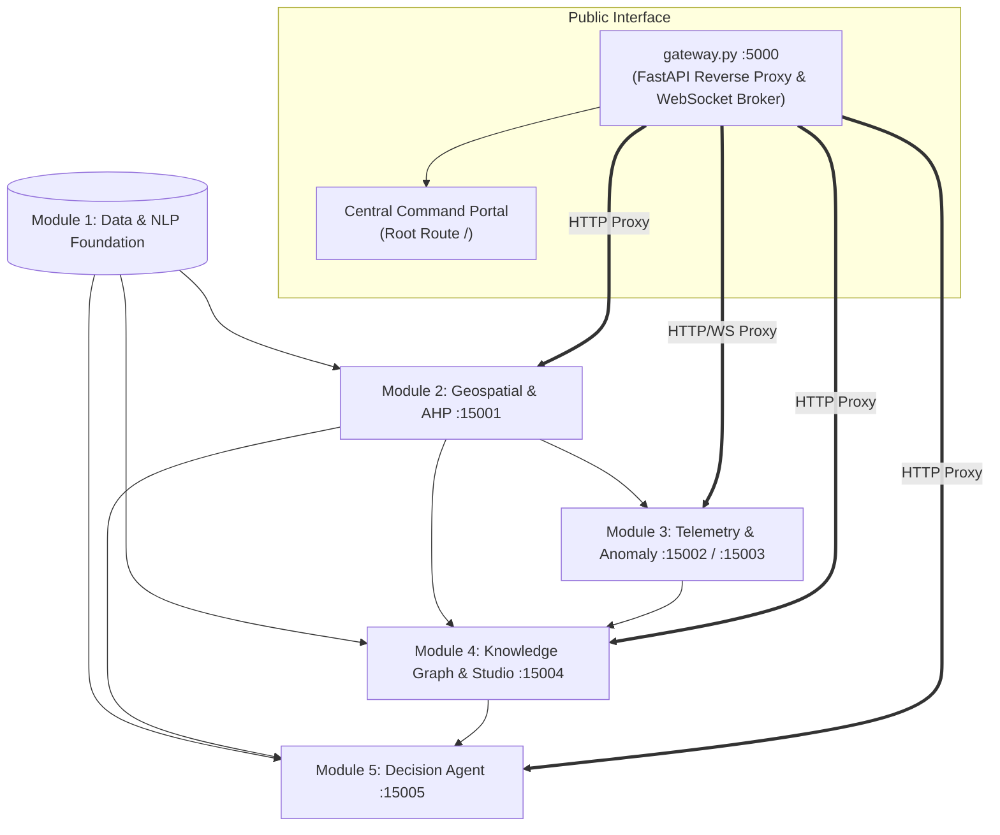
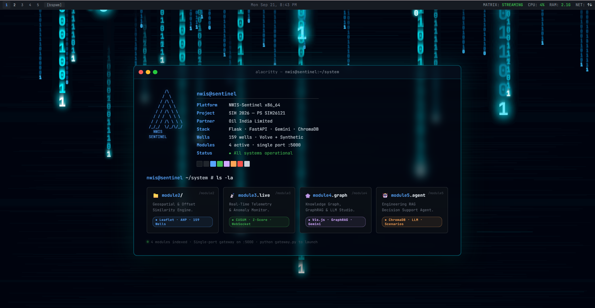
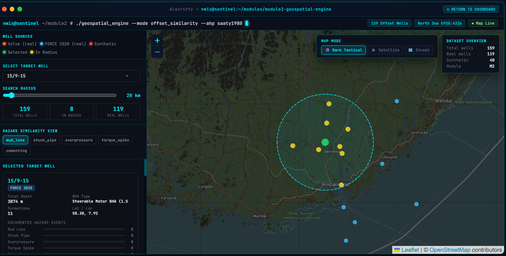

# eRTMAC-NWIS — Nearby Wells Intelligence System
### AI-Powered Offset-Well Knowledge, Real-Time Telemetry & Engineering Decision Support
**Smart India Hackathon (SIH) 2026 | Problem Statement: SIH26121 | Organization: Oil India Limited (OIL)**

---

<p align="center">
  
  
  
  
  
  
  
  
  
  
  
</p>

> **An engineering intelligence layer for Oil India Limited that connects historical drilling knowledge, geospatially similar offset wells, and live drilling telemetry to identify relevant analogs, detect emerging hazards, and deliver evidence-grounded insights for timely engineering decisions.**

---

## 📑 Documentation Guide

This repository contains four specialized documentation files to separate concerns. Please read the document that best fits your role:

* **[README.md](./README.md)** (You are here): Quick start, repository navigation, high-level overview.
* **[PROJECT.md](./PROJECT.md)**: Authoritative source for domain research, problem statement, datasets, and detailed algorithm methodologies (AHP, CUSUM, GraphRAG).
* **[ARCHITECTURE.md](./ARCHITECTURE.md)**: Authoritative source for technical implementation, service ports, runtime topologies, API contracts, and exact backtest mechanics.
* **[NWIS_PROJECT_SHOWCASE.md](./NWIS_PROJECT_SHOWCASE.md)**: SIH Evaluator presentation, demo scenarios, innovation claims, and headline impact.

---

## 1. What the System Does

eRTMAC-NWIS transforms static archives and live WITSML sensor streams into an evidence-grounded engineering intelligence platform. When a drilling hazard is imminent, the system identifies the hazard using dual-algorithm anomaly detection, matches the live sequence against historical offset wells, and uses LLMs (Qwen 2.5-72B and Gemini) constrained by a 4,037-node Knowledge Graph to retrieve explicit historical evidence and recommend interventions. 

**Flagship Result:** +106.48m (~44 min) early warning lead time before a confirmed Stuck Pipe incident on Equinor Volve well 15/9-F-9A.

---

## 2. High-Level Architecture

All modules, WebSocket proxies, and frontends communicate through a **Single-Port Unified Gateway on Port 5000**. Internal microservices bind strictly to `127.0.0.1` and are never exposed across external networks.



---

## 3. Dashboard & Module Showcase

The system features a bespoke cyber-tactical interface designed for real-time mission control rooms.

### 3.1 Central Operations Command Portal

* **Interface:** Unified Operations Portal (`http://localhost:5000/`)
* **What the Engineer Sees:** Single-pane-of-glass overview displaying system-wide operational health, active microservices, real-time node metrics, and 1-click launchers for all four specialized modules.
* **Engineering Impact:** Eliminates fragmented tools by unifying spatial, telemetry, graph, and conversational decision support under one single-origin, enterprise-secure session.

---

### 3.2 Geospatial Intelligence & AHP Offset-Well Selection

* **Interface:** Module 2 Interactive Map (`http://localhost:5000/module2/`)
* **What the Engineer Sees:** Dark Tactical Leaflet map of the North Sea basin (EPSG:4326), dynamic search radius (e.g., 20 km), well category distribution (119 real wells, 40 synthetic controls), and hazard-specific AHP tabs (`mud_loss`, `stuck_pipe`, `overpressure`, `torque_spike`, `cementing`). Target well `15/9-15` shows detailed stratigraphy, BHA mechanics, and historical incident tallies.
* **Engineering Impact:** Evaluates offset relevance using multi-parameter engineering similarity rather than mere geographic proximity.

---

### 3.3 Live Telemetry Streaming & Physical Anomaly Monitor

* **Interface:** Module 3 Monitor (`http://localhost:5000/module3/monitor`)
* **What the Engineer Sees:** Real-time WITSML feed replaying at up to 50x speed. Real-time telemetry cards display Measured Depth (365.3 m), TVD, Rotary Speed, Corrected Hookload (91.3 kkgf), WOB, and Mud Density. The lower console streams CUSUM alerts showing cumulative drift vs. decision interval $h$ with physical diagnostic explanations (e.g., mechanical overpull precursor).
* **Engineering Impact:** Decouples sudden transient noise from genuine, cumulative mechanical degradation, giving drilt-floor teams continuous visibility into downhole friction buildup.

---

### 3.4 Validated Flagship Backtest (+106.48 m Early Warning Lead)

* **Interface:** Module 3 Backtest Studio (`[01] FLAGSHIP_BACKTEST` Tab)
* **What the Engineer Sees:** Dual-panel time-series validation on Volve Well 15/9-F-9A. Upper panel contrasts Hookload and RPM trajectories toward the confirmed stuck pipe incident at 619.00 m MD. Lower panel tracks the predicted Stuck Pipe Risk bounded by **Wilson Score 95% Confidence Intervals**, triggering a sustained critical alert at 512.52 m MD. The right pane confirms **5/5 Zero Future Data Leakage regression tests passed**.
* **Engineering Impact:** Provides a mathematically verified **+106.48-metre (~44-minute)** actionable lead time before pipe seizure, providing sufficient runway for crew remediation (e.g., circulating pills, reaming, mud conditioning).

For details on the flagship backtest validation and the SIH narrative, see **[NWIS_PROJECT_SHOWCASE.md](./NWIS_PROJECT_SHOWCASE.md)**.

---

### 3.5 Knowledge Graph Explorer & GraphRAG Briefing Studio

* **Interface:** Module 4 Knowledge Graph (`http://localhost:5000/module4/`)
* **What the Engineer Sees:** Vis.js interactive graph visualizing 4,037 nodes and 12,392 edges. Highlights target well `15/9-F-9A` and its multi-hop topological connections across formations, events, hazard nodes, and mitigating interventions. The right pane hosts the Gemini Pre-Spud Briefing Studio, verifying 5/5 output sentences against underlying snippet nodes with zero hallucination.
* **Engineering Impact:** Empowers geologists and superintendents to conduct topological root-cause analysis and retrieve multi-hop historical event chains before spudding.

---

### 3.6 Engineering Decision Support Console

* **Interface:** Module 5 Decision Console (`http://localhost:5000/module5/`)
* **What the Engineer Sees:** Mission-critical conversational terminal. Left sidebar tracks active well state (`15/9-F-9A` at 303.5 m MD), live telemetry (Torque 22.5 kNm, WOB 110 kN, ROP 5.5 m/hr, RPM 90, Flow 420 L/min, Pressure 310 bar), and event timeline tokens. Main pane displays **Qwen 2.5-72B** answering complex engineering queries with explicit citations (`SYNTH-W35`, `SYNTH-W09`, `SYNTH-W12`) retrieved from 2,022 indexed records.
* **Engineering Impact:** Delivers synthesized, verified offset interventions directly to drilling superintendents under high-stress operational conditions.


---

## 4. Technology Stack

| Layer | Technologies | Primary Purpose |
|---|---|---|
| **Gateway & Reverse Proxy** | `FastAPI`, `Uvicorn`, `httpx`, `websockets` | Single-port 5000 reverse-proxy, WebSocket forwarding, process orchestration |
| **Microservice Web Engines** | `Flask`, `Flask-CORS`, `Jinja2` | Serving Modules 2, 4, and 5 UI consoles and REST APIs |
| **Real-Time Streaming** | `FastAPI`, `WebSockets`, `asyncio` | High-frequency WITSML sensor replay and anomaly broadcast |
| **Primary LLM** | `Qwen/Qwen2.5-72B-Instruct` (Hugging Face) | Deep engineering reasoning and historical evidence synthesis in Module 5 |
| **AI Briefing LLM** | `Google Gemini 2.5 / 2.0 / 1.5 Flash` | Rapid, verifiable pre-spud briefing synthesis in Module 4 |
| **Offline Synthesis** | Deterministic Local Rule Engine | Offline zero-dependency synthesis fallback |
| **Vector Database** | `ChromaDB` | Embedded vector database indexing 2,022 DDR event snippets |
| **Semantic Embeddings** | `sentence-transformers/all-MiniLM-L6-v2` | Dense vector embeddings for GraphRAG and DDR retrieval |
| **Knowledge Graph** | `NetworkX`, `Vis.js` | Directed property graph (4,037 nodes, 12,392 edges) and network canvas |
| **Mathematical & ML Core** | `NumPy`, `Pandas`, `SciPy`, `scikit-learn` | Matrix operations, rolling statistics, Gaussian kernels, and AHP solvers |
| **Time Series & Statistics** | `fastdtw`, `statsmodels` | Fast Dynamic Time Warping and Wilson Score Confidence Intervals |
| **Geospatial Mapping** | `Leaflet.js`, OpenStreetMap, CartoDB Dark | Tactical interactive well mapping (EPSG:4326) |

---

---

## 5. Setup & Installation

### Prerequisites

Before starting, ensure the following are installed on your system:

* **Operating System:** Windows 10/11, Linux, or macOS
* **Python:** **3.10 or 3.11**
  Download from [python.org](https://www.python.org/downloads/?utm_source=chatgpt.com)

  * **Windows users:** During installation, make sure to enable **"Add Python to PATH"** at the bottom of the installer.
* **Memory:** **4 GB RAM minimum**; **8 GB or more is highly recommended** for the Knowledge Graph.

---

### Option A — Windows 1-Click Launchers **(Recommended / Easiest)**

> **For Windows users, this is the simplest way to run the entire system.**
> The provided launcher automatically starts the API gateway and all five internal microservices, so no manual environment setup or individual service startup is required.

#### Steps

**1. Locate the launcher**

In the **root directory of the project**, locate either:

* `start_all.bat` — recommended for standard Windows usage
* `start_all.ps1` — PowerShell alternative

**2. Launch the system** - Double-click the appropriate file to start the application.

**3. Wait for the services to initialize**
The launcher will automatically:

* Start the **API Gateway**
* Boot all **5 internal microservices**
* Initialize the complete eRTMAC-NWIS system

**4. Open the application** - Once the services have started, open:

**http://localhost:5000**

The system is now ready to use.

---

### Option B — Manual Command-Line Execution **(Cross-Platform)**

Use this method if you are on **macOS/Linux**, prefer command-line execution, or want to manually control the environment and services.

#### 1. Navigate to the core implementation directory

```bash
cd NLP/nlp_task_ddr
```

#### 2. Create a virtual environment

```bash
python -m venv venv
```

Activate the environment:

**Windows:**

```bash
venv\Scripts\activate
```

**macOS/Linux:**

```bash
source venv/bin/activate
```

#### 3. Install the unified dependencies

This is a **one-time setup step**:

```bash
pip install -r ../../requirements.txt
```

#### 4. Verify the project setup

Run the setup verification script to confirm that the required datasets and NLP foundation are correctly placed:

```bash
python check_setup.py
```

#### 5. Launch the Unified Gateway

```bash
python gateway.py
```

Once the gateway has started, open:

**http://localhost:5000**

---
> **Recommendation:** If you are using **Windows**, use **Option A**. It is the intended quick-start path and minimizes the amount of manual configuration required.

## 6. Running the System


| Service / View | Public URL (Port 5000 Gateway) | Description |
|---|---|---|
| **Central Operations Dashboard** | [http://localhost:5000](http://localhost:5000) | Main command center and module navigator |
| **Module 2: Geospatial Map** | [http://localhost:5000/module2/](http://localhost:5000/module2/) | Leaflet map, 159 wells, AHP rankings |
| **Module 3: Live Risk Monitor** | [http://localhost:5000/module3/monitor](http://localhost:5000/module3/monitor) | Real-time CUSUM/Z-Score telemetry monitor |
| **Module 4: Knowledge Graph Studio** | [http://localhost:5000/module4/](http://localhost:5000/module4/) | 4,037-node Vis.js graph & GraphRAG studio |
| **Module 5: Decision Support Agent** | [http://localhost:5000/module5/](http://localhost:5000/module5/) | Qwen 2.5-72B / ChromaDB engineering console |

> Press **Ctrl+C** in your terminal to shut down all background microservices cleanly.

---

## 7. Repository Structure

```
SIH_2026_PLANNS/
├── start_all.bat                      ← Windows 1-click batch launcher
├── start_all.ps1                      ← PowerShell master launcher
├── README.md                          ← Main project documentation
├── ARCHITECTURE.md                    ← Deep-dive system architecture
├── NWIS_PROJECT_SHOWCASE.md           ← Executive summary & competition pitch
├── PROJECT.md                         ← Background research & literature
├── nwis_data_sources.md               ← Data lineage documentation
├── ss/                                ← Production dashboard screenshots
│   ├── main_dash.png                  ← Unified Gateway Operations Portal
│   ├── module_2.png                   ← Geospatial & AHP Engine
│   ├── module3.png                    ← Real-Time Telemetry & Anomaly Engine
│   ├── image copy 2.png               ← Flagship Zero-Leakage Backtest Studio
│   ├── module_4_graph.png             ← Knowledge Graph & Gemini Studio
│   └── moeule5_rag.png                ← Engineering Decision Console (Qwen)
│
└── NLP/nlp_task_ddr/                  ← Core Project Implementation Root
    ├── gateway.py                     ← Unified Gateway (Port 5000 Reverse Proxy)
    ├── requirements.txt               ← Unified Python dependencies
    ├── check_setup.py                 ← Module 1 data integrity validator
    │
    ├── dashboard/                     ← Operations Dashboard (Port 5000 Root)
    │   ├── app.py                     ← Gateway portal Flask app
    │   └── templates/dashboard.html   ← Cyberdeck dark terminal dashboard
    │
    ├── results/module1_outputs/       ← Module 1 Processed Data Foundation
    │   ├── wells_metadata.json        ← 159 wells metadata
    │   ├── events.jsonl               ← 1,959 structured drilling events
    │   ├── flagged_real_incidents.json
    │   └── telemetry/15_9-F-9A.csv    ← 16,670 rows Volve MWD telemetry
    │
    ├── module2/                       ← Geospatial & AHP Engine (:15001)
    │   ├── app.py                     ← Flask microservice
    │   ├── compute_similarity.py      ← AHP, FastDTW, Jaccard, Gaussian logic
    │   ├── templates/map.html         ← Dark Tactical Leaflet UI
    │   └── outputs/analog_wells.json  ← 159 wells × 5 hazards rankings
    │
    ├── module3/                       ← Real-Time Telemetry & Anomaly (:15002/:15003)
    │   ├── simulator_server.py        ← WITSML streaming server (:15002)
    │   ├── anomaly_server.py          ← Real-time anomaly detection server (:15003)
    │   ├── anomaly_detector.py        ← Z-Score & Recursive CUSUM detectors
    │   ├── sequence_matcher.py        ← Smith-Waterman & Wilson CI algorithms
    │   ├── backtest_runner.py         ← Strict causal replay backtest engine
    │   ├── monitor.html               ← Live telemetry dashboard UI
    │   ├── test_leakage.py            ← 5 regression tests for zero data leakage
    │   └── outputs/backtest_result.json ← +106.48 m validated lead output
    │
    ├── module4/                       ← Knowledge Graph & GraphRAG (:15004)
    │   ├── app.py                     ← Flask microservice
    │   ├── knowledge_graph.py         ← NetworkX property graph builder
    │   ├── graph_rag.py               ← Two-stage GraphRAG retrieval engine
    │   ├── llm_briefing.py            ← Gemini Pre-Spud Briefing generator
    │   ├── templates/module4.html     ← Vis.js graph explorer interface
    │   └── outputs/knowledge_graph.gpickle ← Pre-built graph (4,037 nodes)
    │
    └── module5_engineering_agent/     ← Decision Support Agent (:15005)
        ├── app.py                     ← Flask microservice
        ├── config.py                  ← Hugging Face, Gemini & Chroma config
        ├── .env.example               ← Template for API keys
        ├── templates/module5.html     ← Engineering conversational console
        ├── agent/agent.py             ← Qwen 2.5-72B & Gemini fallback agent
        ├── retrieval/retriever.py     ← AHP-constrained vector search
        └── vector_store/chroma_db/    ← Embedded ChromaDB (2,022 records)
```

---


## 8. Current Status / Limitations

For comprehensive details on limitations, data selection rationale, and the gap between this prototype and a production deployment, please refer to **[PROJECT.md](./PROJECT.md)**.
