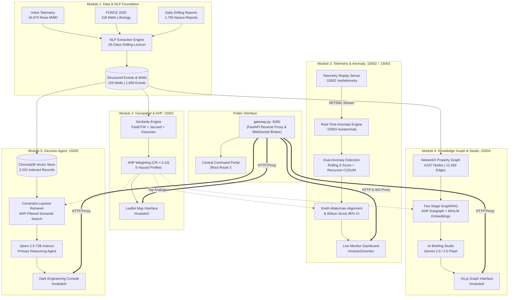
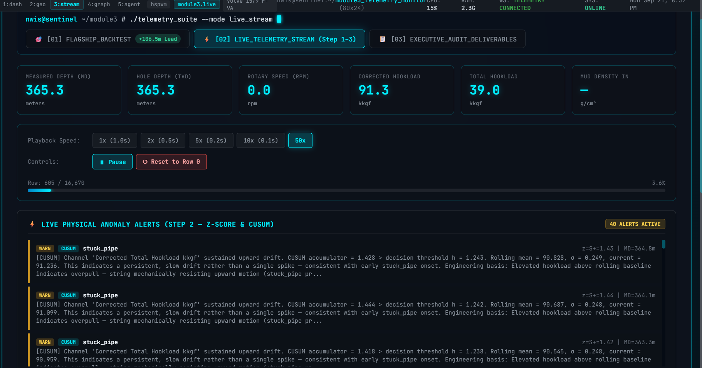
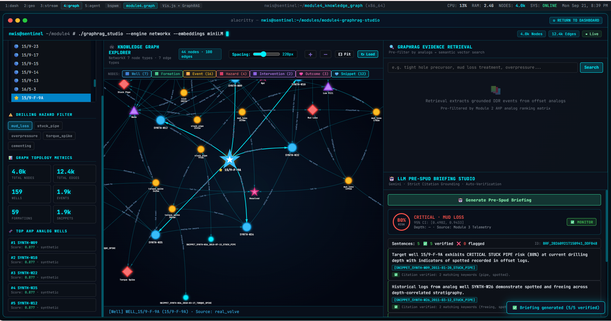
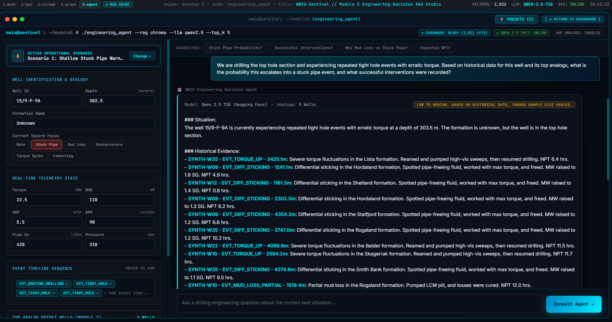

# eRTMAC-NWIS — Nearby Wells Intelligence System
### AI-Powered Offset-Well Knowledge, Real-Time Telemetry & Engineering Decision Support
**Smart India Hackathon (SIH) 2026 | Problem Statement: SIH26121 | Organization: Oil India Limited (OIL)**

---

<p align="center">
  
  
  
  
  
  
  
  
  
  
  
</p>

> **An engineering intelligence layer for Oil India Limited that connects historical drilling knowledge, geospatially similar offset wells, and live drilling telemetry to identify relevant analogs, detect emerging hazards, and deliver evidence-grounded insights for timely engineering decisions.**

---

> [!IMPORTANT]
> **SIH Evaluators & Technical Reviewers:**
> - For an executive breakdown of the problem, algorithmic novelties, verified backtest logs, and dataset statistics, see **[NWIS_PROJECT_SHOWCASE.md](./NWIS_PROJECT_SHOWCASE.md)**.
> - For deep-dive architectural specifications, IPC contracts, and microservice topologies, refer to **[ARCHITECTURE.md](./ARCHITECTURE.md)**.

---

## 📑 Table of Contents

- [1. The Problem Statement (Oil India Limited)](#1-the-problem-statement-oil-india-limited)
- [2. The eRTMAC-NWIS Solution](#2-the-ertmac-nwis-solution)
- [3. Core Philosophy: Human-in-the-Loop AI](#3-core-philosophy-human-in-the-loop-ai)
- [4. System Architecture](#4-system-architecture)
- [5. Dashboard & Module Showcase](#5-dashboard--module-showcase)
- [6. Module-by-Module Deep Dive](#6-module-by-module-deep-dive)
  - [Module 1: Data Foundation & NLP Pipeline](#module-1--data-foundation--nlp-pipeline)
  - [Module 2: Geospatial & AHP Offset Similarity Engine](#module-2--geospatial--ahp-offset-similarity-engine)
  - [Module 3: Real-Time Telemetry & Anomaly Engine](#module-3--real-time-telemetry--anomaly-engine)
  - [Module 4: Knowledge Graph, GraphRAG & AI Studio](#module-4--knowledge-graph-graphrag--ai-studio)
  - [Module 5: Engineering Decision Support Agent](#module-5--engineering-decision-support-agent)
- [7. Core Algorithms & Mathematical Foundations](#7-core-algorithms--mathematical-foundations)
- [8. Flagship Backtest: Zero-Leakage Validation](#8-flagship-backtest-zero-leakage-validation)
- [9. End-to-End Engineering Workflow Scenario](#9-end-to-end-engineering-workflow-scenario)
- [10. Technology Stack](#10-technology-stack)
- [11. Datasets & Provenance](#11-datasets--provenance)
- [12. Innovation & Competitive Edge](#12-innovation--competitive-edge)
- [13. Reliability & Anti-Hallucination Controls](#13-reliability--anti-hallucination-controls)
- [14. Repository Structure](#14-repository-structure)
- [15. Quick Start & Local Execution](#15-quick-start--local-execution)
- [16. Deployment & Enterprise Gateway](#16-deployment--enterprise-gateway)
- [17. Future Scope & Roadmap](#17-future-scope--roadmap)
- [18. References](#18-references)

---

## 1. The Problem Statement (Oil India Limited)

Modern exploration and production operations generate massive volumes of continuous sensor data. Oil India Limited (OIL)'s **eRTMAC (electronic Real-Time Monitoring and Advisory Centre)** monitors active rigs around the clock. However, deep drilling remains fraught with catastrophic geological and mechanical hazards:

* **Differential Sticking & Stuck Pipe:** Drill strings seize in tight formations, halting drilling.
* **Severe Loss of Circulation (Mud Loss):** High-permeability zones or fractures drain drilling fluids.
* **Kicks & Well Control Crises:** Formation fluid influxes pose blowout risks if not countered instantly.
* **Overpressure & Tight Hole:** Sudden geopressure shifts trigger drill-pipe stall and torque spikes.

These events contribute to **Non-Productive Time (NPT)**, accounting for **15% to 25% of total drilling expenditure** — routinely amounting to **₹60 to ₹200 Crores in downtime and recovery operations per incident**.

```
┌────────────────────────────────────────────────────────────────────────┐
│                        THE DRILLING KNOWLEDGE PARADOX                  │
├────────────────────────────────────────────────────────────────────────┤
│  Decades of well history exist in Daily Drilling Reports (DDRs),       │
│  mud logs, and sensor archives. But when a live hookload drift occurs: │
│                                                                        │
│  ❌ Knowledge is trapped in PDFs, unstructured text, and field notes    │
│  ❌ Naive geographic search fails (distance ≠ geological analog)       │
│  ❌ Engineers lack automated answers to 5 critical questions:          │
│     1. Which historical offset wells are genuinely comparable?         │
│     2. Has this formation caused similar precursors before?            │
│     3. What sequence of events followed this early warning?            │
│     4. What specific intervention cured the issue historically?        │
│     5. What verifiable evidence supports the recommendation?           │
└────────────────────────────────────────────────────────────────────────┘
```

---

## 2. The eRTMAC-NWIS Solution

**eRTMAC-NWIS (Nearby Wells Intelligence System)** bridges real-time telemetry and historical drilling knowledge. It transforms static archives and live WITSML sensor streams into an evidence-grounded engineering intelligence platform.

```
                    eRTMAC-NWIS INTELLIGENCE CHAIN
 
  [ Historical DDR Corpus ]           [ Live WITSML Telemetry Stream ]
             │                                       │
             ▼                                       ▼
  [ 18-Class NLP Extraction ]         [ Dual Anomaly Engine (Z-Score + CUSUM) ]
             │                                       │
             ▼                                       ▼
  [ Multi-Hazard AHP Ranking ]        [ Event Precursor Sequence Formation ]
             │                                       │
             └───────────────────┬───────────────────┘
                                 ▼
              [ Smith-Waterman Sequence Alignment ]
                                 │
                                 ▼
              [ 4,037-Node Knowledge Graph & GraphRAG ]
                                 │
                                 ▼
              [ Constraint-Layered ChromaDB Vector Retrieval ]
                                 │
                                 ▼
              [ Citation-Enforced LLM Synthesis (Qwen / Gemini) ]
                                 │
                                 ▼
              [ Drilling Engineer's Final Operational Decision ]
```

---

## 3. Core Philosophy: Human-in-the-Loop AI

In safety-critical petroleum drilling, **autonomous black-box AI is unacceptable**. A false recommendation or hallucinated pressure threshold can trigger blowouts or catastrophic string loss.

> [!CAUTION]
> ### The NWIS Axiom
> **"The AI finds the relevant evidence. RAG retrieves it. The LLM explains it. The qualified Drilling Engineer makes the operational decision."**

eRTMAC-NWIS is engineered with absolute mathematical and factual guardrails:
1. **The LLM is NOT the database:** Sensor readings, formation depths, AHP scores, and event sequences are calculated deterministically.
2. **Strict Citation Grounding:** Every insight generated by Qwen 2.5 or Gemini must quote an exact historical record `[WELL_ID — EVENT_TYPE — DEPTH_m]`. Uncited claims are rejected.
3. **Deterministic Offline Fallback:** If LLM inference APIs are unreachable, a deterministic local synthesis engine extracts and formats the evidence directly from the GraphRAG pipeline without dropping operational readiness.

---

## 4. System Architecture

All modules, WebSocket proxies, and frontends communicate through a **Single-Port Unified Gateway on Port 5000**. Internal microservices bind strictly to `127.0.0.1` and are never exposed across external networks.



---

## 5. Dashboard & Module Showcase

The system features a bespoke cyber-tactical interface designed for real-time mission control rooms.

### 5.1 Central Operations Command Portal

* **Interface:** Unified Operations Portal (`http://localhost:5000/`)
* **What the Engineer Sees:** Single-pane-of-glass overview displaying system-wide operational health, active microservices, real-time node metrics, and 1-click launchers for all four specialized modules.
* **Engineering Impact:** Eliminates fragmented tools by unifying spatial, telemetry, graph, and conversational decision support under one single-origin, enterprise-secure session.

---

### 5.2 Geospatial Intelligence & AHP Offset-Well Selection

* **Interface:** Module 2 Interactive Map (`http://localhost:5000/module2/`)
* **What the Engineer Sees:** Dark Tactical Leaflet map of the North Sea basin (EPSG:4326), dynamic search radius (e.g., 20 km), well category distribution (119 real wells, 40 synthetic controls), and hazard-specific AHP tabs (`mud_loss`, `stuck_pipe`, `overpressure`, `torque_spike`, `cementing`). Target well `15/9-15` shows detailed stratigraphy, BHA mechanics, and historical incident tallies.
* **Engineering Impact:** Evaluates offset relevance using multi-parameter engineering similarity rather than mere geographic proximity.

---

### 5.3 Live Telemetry Streaming & Physical Anomaly Monitor

* **Interface:** Module 3 Monitor (`http://localhost:5000/module3/monitor`)
* **What the Engineer Sees:** Real-time WITSML feed replaying at up to 50x speed. Real-time telemetry cards display Measured Depth (365.3 m), TVD, Rotary Speed, Corrected Hookload (91.3 kkgf), WOB, and Mud Density. The lower console streams CUSUM alerts showing cumulative drift vs. decision interval $h$ with physical diagnostic explanations (e.g., mechanical overpull precursor).
* **Engineering Impact:** Decouples sudden transient noise from genuine, cumulative mechanical degradation, giving drilt-floor teams continuous visibility into downhole friction buildup.

---

### 5.4 Validated Flagship Backtest (+106.48 m Early Warning Lead)

* **Interface:** Module 3 Backtest Studio (`[01] FLAGSHIP_BACKTEST` Tab)
* **What the Engineer Sees:** Dual-panel time-series validation on Volve Well 15/9-F-9A. Upper panel contrasts Hookload and RPM trajectories toward the confirmed stuck pipe incident at 619.00 m MD. Lower panel tracks the predicted Stuck Pipe Risk bounded by **Wilson Score 95% Confidence Intervals**, triggering a sustained critical alert at 512.52 m MD. The right pane confirms **5/5 Zero Future Data Leakage regression tests passed**.
* **Engineering Impact:** Provides a mathematically verified **+106.48-metre (~44-minute)** actionable lead time before pipe seizure, providing sufficient runway for crew remediation (e.g., circulating pills, reaming, mud conditioning).

---

### 5.5 Knowledge Graph Explorer & GraphRAG Briefing Studio

* **Interface:** Module 4 Knowledge Graph (`http://localhost:5000/module4/`)
* **What the Engineer Sees:** Vis.js interactive graph visualizing 4,037 nodes and 12,392 edges. Highlights target well `15/9-F-9A` and its multi-hop topological connections across formations, events, hazard nodes, and mitigating interventions. The right pane hosts the Gemini Pre-Spud Briefing Studio, verifying 5/5 output sentences against underlying snippet nodes with zero hallucination.
* **Engineering Impact:** Empowers geologists and superintendents to conduct topological root-cause analysis and retrieve multi-hop historical event chains before spudding.

---

### 5.6 Engineering Decision Support Console

* **Interface:** Module 5 Decision Console (`http://localhost:5000/module5/`)
* **What the Engineer Sees:** Mission-critical conversational terminal. Left sidebar tracks active well state (`15/9-F-9A` at 303.5 m MD), live telemetry (Torque 22.5 kNm, WOB 110 kN, ROP 5.5 m/hr, RPM 90, Flow 420 L/min, Pressure 310 bar), and event timeline tokens. Main pane displays **Qwen 2.5-72B** answering complex engineering queries with explicit citations (`SYNTH-W35`, `SYNTH-W09`, `SYNTH-W12`) retrieved from 2,022 indexed records.
* **Engineering Impact:** Delivers synthesized, verified offset interventions directly to drilling superintendents under high-stress operational conditions.

---

## 6. Module-by-Module Deep Dive

### Module 1 — Data Foundation & NLP Pipeline
* **Purpose:** Ingest unstructured legacy Daily Drilling Reports (DDRs), lithology logs, and high-frequency MWD telemetry; extract structured, queryable event records.
* **Inputs:** 1,759 Volve DDR text reports (`bengsoon/volve_alpaca`), 118 FORCE 2020 North Sea well logs, and 16,670 rows of Volve 15/9-F-9A 1-Hz sensor telemetry.
* **Internal Processing:** Employs a regex-driven deterministic parser built on an **18-class canonical petroleum lexicon**. Extracts well identifiers, measured depths, formations, mud densities, lost volumes, NPT hours, and event classifications. Incorporates 200 synthetic control reports (`seed=42`) explicitly tagged `is_synthetic: True`.
* **Outputs:** `wells_metadata.json` (159 wells), `events.jsonl` (1,959 structured events), and clean telemetry CSVs.
* **Engineering Value:** Standardizes messy, shorthand-filled driller logs into machine-actionable event structures without information loss.

---

### Module 2 — Geospatial & AHP Offset Similarity Engine
* **Purpose:** Calculate multidimensional analog scores between the active well and historical offset wells.
* **Inputs:** Well coordinates, directional survey trajectories, mud weight programs, BHA configurations, and stratigraphy.
* **Internal Processing:** Executes the **Analytic Hierarchy Process (Saaty, 1980)**. Computes pairwise comparison matrices across 5 engineering dimensions. Trajectory similarity uses **Fast Dynamic Time Warping (FastDTW)**; BHA, mud type, and formations use **Jaccard set similarity**; mud weight uses a **Gaussian decay kernel** $e^{-\Delta^2 / (2 \cdot 0.3^2)}$. All matrices satisfy Consistency Ratio $CR < 0.10$.
* **Outputs:** `analog_wells.json` (159 wells ranked across 5 distinct hazards), `ahp_weights.json`, and interactive Leaflet map layers.
* **Engineering Value:** Prevents misleading analog selection by ensuring offset wells reflect identical physical and mechanical constraints for the hazard under review.

---

### Module 3 — Real-Time Telemetry & Anomaly Engine
* **Purpose:** Replay high-frequency telemetry, detect physical sensor anomalies, and compute real-time hazard probabilities.
* **Inputs:** Real-time WITSML sensor streams (Hookload, WOB, Torque, RPM, Standpipe Pressure, Mud In/Out Density).
* **Internal Processing:**
  1. *Dual Anomaly Detector:* Runs rolling **Z-Score** ($W=30$ rows) for rapid transient spikes alongside a recursive **CUSUM accumulator** ($k=0.5\sigma, h=5.0\sigma$) for subtle, creeping mechanical drift.
  2. *Sequence Tokenizer:* Converts physical deviations into chronological discrete event tokens.
  3. *Smith-Waterman Alignment:* Matches live token sequences against historical hazard sequences in top AHP analog wells.
  4. *Wilson Confidence Bound:* Estimates failure probability bounded by a 95% Wilson Score confidence interval.
* **Outputs:** Live WebSocket alert streams (`/ws/telemetry`, `/ws/anomaly`), `risk_predictions.jsonl`, and backtest logs.
* **Engineering Value:** Delivers actionable, verified warnings tens of metres before catastrophic pipe sticking occurs.

---

### Module 4 — Knowledge Graph, GraphRAG & AI Studio
* **Purpose:** Model complex relationships among wells, lithologies, events, and interventions; synthesize pre-spud risk briefings.
* **Inputs:** Structured event streams, AHP analog tables, and DDR summary snippets.
* **Internal Processing:**
  1. *Graph Topology:* In-memory NetworkX directed property graph with 4,037 nodes and 12,392 typed edges (`DRILLED_THROUGH`, `HAS_EVENT`, `PRECEDES`, `IS_ANALOG_OF`, `LED_TO`, `MITIGATED_BY`, `RESULTED_IN`, `HAS_SNIPPET`).
  2. *Two-Stage GraphRAG:* Stage 1 filters the graph to the top-10 AHP analog subgraph. Stage 2 embeds report snippets using `sentence-transformers/all-MiniLM-L6-v2` for semantic ranking.
  3. *AI Briefing Studio:* Google Gemini generates structured briefings with automated sentence-by-sentence citation verification.
* **Outputs:** Interactive Vis.js network visualization, serialized graph pickle, and verifiable briefing summaries.
* **Engineering Value:** Enables multi-hop reasoning (e.g., *Well A $\rightarrow$ Formation B $\rightarrow$ Overpressure $\rightarrow$ Stuck Pipe $\rightarrow$ Cured by Jarring*) in seconds.

---

### Module 5 — Engineering Decision Support Agent
* **Purpose:** Provide an interactive engineering console where drilling superintendents can query historical offset precedent during live crises.
* **Inputs:** Live telemetry state, formation context, active event timeline tokens, and engineer natural-language prompts.
* **Internal Processing:** Queries an embedded **ChromaDB vector store** containing 2,022 indexed historical DDR records. Constrains semantic similarity strictly to top-K AHP analogs. Feeds retrieved context into **Qwen 2.5-72B-Instruct** (via Hugging Face Inference API) with secondary fallback to **Google Gemini** and offline deterministic rule synthesis.
* **Outputs:** Evidence-grounded conversational responses with mandatory `[WELL_ID — EVENT_TYPE — DEPTH_m]` citations.
* **Engineering Value:** Gives field personnel instant, structured access to proven historical remedies during high-stakes drilling anomalies.

---

## 7. Core Algorithms & Mathematical Foundations

### 7.1 Analytic Hierarchy Process (AHP) Multi-Criteria Weighting
To evaluate offset well similarity rigorously, eRTMAC-NWIS implements Saaty’s Analytic Hierarchy Process (1980). A positive reciprocal pairwise comparison matrix $A = [a_{ij}]$ is constructed for each hazard:

$$A w = \lambda_{\max} w, \quad \text{CI} = \frac{\lambda_{\max} - n}{n - 1}, \quad \text{CR} = \frac{\text{CI}}{\text{RI}_n} < 0.10$$

For Stuck Pipe, trajectory inclination profiles are compared via FastDTW, yielding the validated weighting profile:
* **Trajectory Shape ($w_1 = 0.4971$):** $\text{FastDTW}(\text{inclination}_A, \text{inclination}_B)$
* **BHA Mechanical Configuration ($w_2 = 0.2454$):** Jaccard token overlap
* **Mud Density Program ($w_3 = 0.1053$):** $\exp\left(-\frac{(\rho_A - \rho_B)^2}{2 \cdot 0.3^2}\right)$
* **Mud Chemical Type ($w_4 = 0.1053$):** Jaccard token overlap
* **Formation Stratigraphy ($w_5 = 0.0469$):** Jaccard formation overlap

$$\text{Composite Similarity} = \sum_{k=1}^{5} w_k \cdot S_k(\text{Active Well}, \text{Offset Well})$$

> *Note: A similarity score of 0.87 denotes an 87% multi-criteria match under the assigned AHP weighting. It does not represent an 87% incident probability.*

---

### 7.2 Dual-Algorithm Anomaly Detection

To detect both sudden mechanical stalls and slow, imperceptible friction buildup, Module 3 executes dual concurrent detection loops:

```
                  DUAL-ALGORITHM DETECTION TOPOLOGY
 
                     [ Live Telemetry Channel ]
                                 │
                 ┌───────────────┴───────────────┐
                 ▼                               ▼
      [ Rolling Z-Score Loop ]        [ Recursive CUSUM Loop ]
         Window W = 30 rows              k = 0.5σ, h = 5.0σ
                 │                               │
                 ▼                               ▼
      Fast Spikes & Transients        Slow, Persistent Drift
      (Kick, Severe Loss, Stall)     (Tight Hole, Hookload Drift)
                 │                               │
                 └───────────────┬───────────────┘
                                 ▼
                     [ Combined Anomaly State ]
```

1. **Rolling Z-Score (Transient Detection):**
   $$\mu_t = \frac{1}{W}\sum_{i=0}^{W-1} x_{t-i}, \quad \sigma_t = \sqrt{\frac{1}{W}\sum_{i=0}^{W-1}(x_{t-i} - \mu_t)^2}, \quad z_t = \frac{x_t - \mu_t}{\sigma_t}$$
   $$\text{Thresholds: } |z_t| \ge 2.5\sigma \text{ (WARN)}, \ge 3.0\sigma \text{ (ALERT)}, \ge 4.0\sigma \text{ (CRITICAL)}$$

2. **Recursive Two-Sided CUSUM (Persistent Drift Detection):**
   $$S_t^+ = \max\left(0, S_{t-1}^+ + (x_t - \mu_t) - k\sigma_t\right), \quad S_t^- = \max\left(0, S_{t-1}^- - (x_t - \mu_t) - k\sigma_t\right)$$
   $$\text{Alarm Condition: } \max(S_t^+, S_t^-) > h\sigma_t \quad (k = 0.5, h = 5.0)$$

---

### 7.3 Smith-Waterman Local Sequence Alignment
Borrowing from molecular bioinformatics, eRTMAC-NWIS adapts the **Smith-Waterman algorithm (1981)** to align live drilling event sequences against historical offset sequences.

Let $A = (a_1, a_2, \dots, a_n)$ be the active event sequence and $B = (b_1, b_2, \dots, b_m)$ be an offset well sequence. The dynamic programming scoring matrix $H$ is constructed as:

$$H_{i,j} = \max \begin{cases} 
0 \\
H_{i-1,j-1} + s(a_i, b_j) & \text{(Match / Mismatch)} \\
H_{i-1,j} - d & \text{(Deletion / Gap)} \\
H_{i,j-1} - d & \text{(Insertion / Gap)} 
\end{cases}$$

$$\text{Scoring Parameters: } s(a_i, b_j) = \begin{cases} +4 & \text{if } a_i = b_j \text{ (Exact event token match)} \\ +2 & \text{if category}(a_i) = \text{category}(b_j) \\ -1 & \text{if mismatch} \end{cases}, \quad d = 1 \text{ (Gap penalty)}$$

The optimal local alignment score is $H^* = \max_{i,j} H_{i,j}$. This permits identification of precursor patterns even when drilling events occur with altered durations or skipped intermediary steps.

---

### 7.4 Wilson Score Confidence Intervals
When estimating incident risk across small analog samples ($K = 5 \text{ to } 10$), standard normal approximations fail. eRTMAC-NWIS computes the **Wilson Score 95% Confidence Interval**:

$$\hat{p} = \frac{n_{\text{aligned}}}{K}, \quad \text{CI}_{95\%} = \frac{\hat{p} + \frac{z^2}{2K} \pm z \sqrt{\frac{\hat{p}(1-\hat{p})}{K} + \frac{z^2}{4K^2}}}{1 + \frac{z^2}{K}} \quad (z = 1.95996)$$

This provides statistically honest error bars, avoiding false precision when reporting risk estimates to drilling managers.

---

## 8. Flagship Backtest: Zero-Leakage Validation

To prove real-world predictive validity, Module 3 was benchmarked against the real **Equinor Volve Well 15/9-F-9A** MWD telemetry dataset (16,670 rows, 273.1 m to 1,206.0 m MD).

```
                            VOLVE 15/9-F-9A BACKTEST TIMELINE
 
   302.2 m MD               303.6 m MD               512.52 m MD              619.00 m MD
───────┬────────────────────────┬─────────────────────────┬────────────────────────┬───────► Depth
       │                        │                         │                        │
       ▼                        ▼                         ▼                        ▼
  First CUSUM              Actionable CRITICAL        Sustained Actionable     CONFIRMED STUCK PIPE
  Hookload Drift Detected  Alert (Wilson CI = 0.80)   Warning Threshold        INCIDENT (Row 4,663)
                                                      │◄─── +106.48 METRES ───►│
                                                      │     (~44 MINUTES LEAD) │
```

### Verified Benchmark Metrics
* **Confirmed Historical Incident:** `EVT_STUCK_PIPE` at **619.00 m MD** (Row 4,663). DDR Record: *"Troubleshot stuck tool, released tieback adapter and POOH tieback with stuck tool inside."*
* **First Precursor Identified:** **302.2 m MD** (CUSUM hookload positive drift accumulator crossed $h$).
* **Sustained Actionable Threshold:** **512.52 m MD** (Wilson Score Point Estimate = 0.80, Lower Bound = 0.49, Upper Bound = 0.94).
* **Actionable Lead Distance:** **+106.48 metres**.
* **Actionable Lead Time:** **~44 minutes** at observed average rate of penetration (ROP).

### The Zero-Data-Leakage Guarantee
The replay engine adheres to strict causal temporal invariance verified by 5 regression unit tests in `test_leakage.py`:
1. **Temporal Horizon Shield:** At step $t$, the detector has zero access to data at $t+1$.
2. **Causal Normalization:** Rolling baselines $(\mu_t, \sigma_t)$ strictly compute within $[t-W+1, t]$.
3. **Recursive State Continuity:** CUSUM accumulators update recursively with zero future lookahead.
4. **Target Well Exclusion:** Well 15/9-F-9A is strictly barred from its own analog candidate pool.
5. **Automated Verification:** All 5 tests pass before deployment (`5/5 PASS`).

---

## 9. End-to-End Engineering Workflow Scenario

```
   1. SENSOR DRIFT        Live telemetry exhibits persistent hookload drift at 2,651 m in Sandstone.
         │
         ▼
   2. ANOMALY DETECT      CUSUM accumulator crosses 5.0σ; Z-score indicates +2.7σ upward deviation.
         │
         ▼
   3. SPATIAL FILTER      Module 2 AHP selects top 5 offset wells based on Trajectory + Mud + BHA.
         │
         ▼
   4. SEQUENCE MATCH      Smith-Waterman aligns [ROUTINE -> TIGHT_HOLE -> TORQUE_UP] (Score: 0.58).
         │
         ▼
   5. GRAPH TRAVERSAL     Module 4 GraphRAG traverses 15/9-F-9A -> Hordaland Sandstone -> Analog Logs.
         │
         ▼
   6. VECTOR RETRIEVAL    ChromaDB pulls DDR records citing tight hole remediation in offset wells.
         │
         ▼
   7. CITATION BRIEF      Qwen 2.5 synthesizes: "2/5 analogs pumped 20 bbl hi-vis pill; 1 required jarring."
         │
         ▼
   8. HUMAN DECISION      Drilling Superintendent halts advance, reciprocates pipe, circulates pill.
```

---

## 10. Technology Stack

| Layer | Technologies | Primary Purpose |
|---|---|---|
| **Gateway & Reverse Proxy** | `FastAPI`, `Uvicorn`, `httpx`, `websockets` | Single-port 5000 reverse-proxy, WebSocket forwarding, process orchestration |
| **Microservice Web Engines** | `Flask`, `Flask-CORS`, `Jinja2` | Serving Modules 2, 4, and 5 UI consoles and REST APIs |
| **Real-Time Streaming** | `FastAPI`, `WebSockets`, `asyncio` | High-frequency WITSML sensor replay and anomaly broadcast |
| **Primary LLM** | `Qwen/Qwen2.5-72B-Instruct` (Hugging Face) | Deep engineering reasoning and historical evidence synthesis in Module 5 |
| **AI Briefing LLM** | `Google Gemini 2.5 / 2.0 / 1.5 Flash` | Rapid, verifiable pre-spud briefing synthesis in Module 4 |
| **Offline Synthesis** | Deterministic Local Rule Engine | Offline zero-dependency synthesis fallback |
| **Vector Database** | `ChromaDB` | Embedded vector database indexing 2,022 DDR event snippets |
| **Semantic Embeddings** | `sentence-transformers/all-MiniLM-L6-v2` | Dense vector embeddings for GraphRAG and DDR retrieval |
| **Knowledge Graph** | `NetworkX`, `Vis.js` | Directed property graph (4,037 nodes, 12,392 edges) and network canvas |
| **Mathematical & ML Core** | `NumPy`, `Pandas`, `SciPy`, `scikit-learn` | Matrix operations, rolling statistics, Gaussian kernels, and AHP solvers |
| **Time Series & Statistics** | `fastdtw`, `statsmodels` | Fast Dynamic Time Warping and Wilson Score Confidence Intervals |
| **Geospatial Mapping** | `Leaflet.js`, OpenStreetMap, CartoDB Dark | Tactical interactive well mapping (EPSG:4326) |

---

## 11. Datasets & Provenance

eRTMAC-NWIS strictly distinguishes between real, verified field data and synthetic controls:

| Dataset | Provenance | Scale | Classification | Role in System |
|---|---|---|---|---|
| **Equinor Volve DDRs** | Hugging Face (`bengsoon/volve_alpaca`) | 1,759 reports (~9 wellbores) | **REAL DATA** | Historical event extraction and vector corpus |
| **Volve 15/9-F-9A Telemetry** | Equinor Open Data / WITSML | 16,670 rows (15 channels) | **REAL DATA** | 1-Hz streaming replay and flagship backtest |
| **FORCE 2020 Lithology** | Zenodo (#4351156) / NPD | 118 NCS Wells | **REAL DATA** | Stratigraphic formation tops and well trajectories |
| **FORCE 2020 Casing** | Zenodo / Norwegian Offshore | 118 NCS Wells | **REAL DATA** | Well casing depths and hole geometry |
| **Synthetic DDR Corpus** | Python RNG (`random.seed(42)`) | 200 reports (40 wells) | **SYNTHETIC** | Edge-case verification; explicitly tagged `is_synthetic: True` |

> *Why Synthetic Data?* Operational drilling logs from active Indian basins are proprietary and classified under national energy security regulations. Combining open-access North Sea field data with explicitly tagged synthetic edge cases demonstrates full scalability without compromising data integrity.

---

## 12. Innovation & Competitive Edge

| Capability | Conventional Drilling SCADA | Generic RAG Chatbots | eRTMAC-NWIS (This Project) |
|---|---|---|---|
| **Analog Selection** | Naive radial distance (km) | None / Random document retrieval | **Hazard-specific AHP weighting (CR < 0.10)** |
| **Drift Detection** | Static scalar thresholds | None | **Dual Rolling Z-Score + Recursive CUSUM** |
| **Temporal Matching** | None | None | **Smith-Waterman event sequence alignment** |
| **Uncertainty Model** | None | Uncalibrated LLM confidence | **Wilson Score 95% Confidence Intervals** |
| **Knowledge Store** | Relational SQL tables | Flat vector database | **4,037-Node GraphRAG + ChromaDB Vector Store** |
| **Hallucination Risk** | N/A | High (confabulated depths/pressures) | **Zero (Strict citation grounding + Local fallback)** |
| **Network Footprint** | Multi-port firewall headache | Cloud-only dependencies | **Single-Port 5000 Unified Gateway** |

---

## 13. Reliability & Anti-Hallucination Controls

In offshore drilling, hallucinated advice is dangerous. eRTMAC-NWIS implements **Constraint-Layered Grounding**:

```
                       ANTI-HALLUCINATION FUNNEL
 
      [ 1,959 Total Historical Events Across 159 Wells ]
                             │
                             ▼
      [ Filter 1: AHP Multi-Criteria Analog Subgraph ]
        Excludes 90% of irrelevant geological formations
                             │
                             ▼
      [ Filter 2: ChromaDB Dense Semantic Retrieval ]
        Pulls top-K matching event snippets within analogs
                             │
                             ▼
      [ Filter 3: Strict Prompt Constraint Injection ]
        "Cite [WELL - EVENT - DEPTH]. Reject ungrounded facts."
                             │
                             ▼
      [ Filter 4: Automated Citation Verification Engine ]
        Re-parses output text against underlying graph nodes
                             │
                             ▼
      [ Output Briefing: 100% Grounded in Historical Evidence ]
```

* **No Uncited Claims:** Responses must cite historical source snippets.
* **Deterministic Synthesis:** When running offline, briefings are generated by rule-based template aggregators without calling any LLM API.
* **Traceable Audit Trail:** Every event record preserves its source document hash and raw text excerpt.

---

## 14. Repository Structure

```
SIH_2026_PLANNS/
├── start_all.bat                      ← Windows 1-click batch launcher
├── start_all.ps1                      ← PowerShell master launcher
├── README.md                          ← Main project documentation
├── ARCHITECTURE.md                    ← Deep-dive system architecture
├── NWIS_PROJECT_SHOWCASE.md           ← Executive summary & competition pitch
├── PROJECT.md                         ← Background research & literature
├── nwis_data_sources.md               ← Data lineage documentation
├── ss/                                ← Production dashboard screenshots
│   ├── main_dash.png                  ← Unified Gateway Operations Portal
│   ├── module_2.png                   ← Geospatial & AHP Engine
│   ├── module3.png                    ← Real-Time Telemetry & Anomaly Engine
│   ├── image copy 2.png               ← Flagship Zero-Leakage Backtest Studio
│   ├── module_4_graph.png             ← Knowledge Graph & Gemini Studio
│   └── moeule5_rag.png                ← Engineering Decision Console (Qwen)
│
└── NLP/nlp_task_ddr/                  ← Core Project Implementation Root
    ├── gateway.py                     ← Unified Gateway (Port 5000 Reverse Proxy)
    ├── requirements.txt               ← Unified Python dependencies
    ├── check_setup.py                 ← Module 1 data integrity validator
    │
    ├── dashboard/                     ← Operations Dashboard (Port 5000 Root)
    │   ├── app.py                     ← Gateway portal Flask app
    │   └── templates/dashboard.html   ← Cyberdeck dark terminal dashboard
    │
    ├── results/module1_outputs/       ← Module 1 Processed Data Foundation
    │   ├── wells_metadata.json        ← 159 wells metadata
    │   ├── events.jsonl               ← 1,959 structured drilling events
    │   ├── flagged_real_incidents.json
    │   └── telemetry/15_9-F-9A.csv    ← 16,670 rows Volve MWD telemetry
    │
    ├── module2/                       ← Geospatial & AHP Engine (:15001)
    │   ├── app.py                     ← Flask microservice
    │   ├── compute_similarity.py      ← AHP, FastDTW, Jaccard, Gaussian logic
    │   ├── templates/map.html         ← Dark Tactical Leaflet UI
    │   └── outputs/analog_wells.json  ← 159 wells × 5 hazards rankings
    │
    ├── module3/                       ← Real-Time Telemetry & Anomaly (:15002/:15003)
    │   ├── simulator_server.py        ← WITSML streaming server (:15002)
    │   ├── anomaly_server.py          ← Real-time anomaly detection server (:15003)
    │   ├── anomaly_detector.py        ← Z-Score & Recursive CUSUM detectors
    │   ├── sequence_matcher.py        ← Smith-Waterman & Wilson CI algorithms
    │   ├── backtest_runner.py         ← Strict causal replay backtest engine
    │   ├── monitor.html               ← Live telemetry dashboard UI
    │   ├── test_leakage.py            ← 5 regression tests for zero data leakage
    │   └── outputs/backtest_result.json ← +106.48 m validated lead output
    │
    ├── module4/                       ← Knowledge Graph & GraphRAG (:15004)
    │   ├── app.py                     ← Flask microservice
    │   ├── knowledge_graph.py         ← NetworkX property graph builder
    │   ├── graph_rag.py               ← Two-stage GraphRAG retrieval engine
    │   ├── llm_briefing.py            ← Gemini Pre-Spud Briefing generator
    │   ├── templates/module4.html     ← Vis.js graph explorer interface
    │   └── outputs/knowledge_graph.gpickle ← Pre-built graph (4,037 nodes)
    │
    └── module5_engineering_agent/     ← Decision Support Agent (:15005)
        ├── app.py                     ← Flask microservice
        ├── config.py                  ← Hugging Face, Gemini & Chroma config
        ├── .env.example               ← Template for API keys
        ├── templates/module5.html     ← Engineering conversational console
        ├── agent/agent.py             ← Qwen 2.5-72B & Gemini fallback agent
        ├── retrieval/retriever.py     ← AHP-constrained vector search
        └── vector_store/chroma_db/    ← Embedded ChromaDB (2,022 records)
```

---

## 15. Quick Start & Local Execution

### Prerequisites
* **OS:** Windows 10/11, Linux, or macOS
* **Python:** Version **3.10+** (Python 3.10 or 3.11 recommended)
* **Memory:** 4 GB RAM minimum (8 GB recommended)

---

### Option A: Windows 1-Click Launchers (Easiest)

Double-click `start_all.bat` in the repository root, or run from PowerShell:

```powershell
.\start_all.ps1
```

The script automatically initiates `gateway.py`, boots all 5 internal microservices, and opens `http://localhost:5000` in your default browser.

---

### Option B: Manual Command-Line Execution

```bash
# 1. Navigate to the core implementation directory
cd NLP/nlp_task_ddr

# 2. Install all unified dependencies (one-time setup)
pip install -r requirements.txt

# 3. Verify data integrity (verifies Module 1 outputs)
python check_setup.py

# 4. Launch the Unified Gateway
python gateway.py
```

Open your browser to: **`http://localhost:5000`**

### Active Service Endpoints

| Service / View | Public URL (Port 5000 Gateway) | Description |
|---|---|---|
| **Central Operations Dashboard** | [http://localhost:5000](http://localhost:5000) | Main command center and module navigator |
| **Module 2: Geospatial Map** | [http://localhost:5000/module2/](http://localhost:5000/module2/) | Leaflet map, 159 wells, AHP rankings |
| **Module 3: Live Risk Monitor** | [http://localhost:5000/module3/monitor](http://localhost:5000/module3/monitor) | Real-time CUSUM/Z-Score telemetry monitor |
| **Module 4: Knowledge Graph Studio** | [http://localhost:5000/module4/](http://localhost:5000/module4/) | 4,037-node Vis.js graph & GraphRAG studio |
| **Module 5: Decision Support Agent** | [http://localhost:5000/module5/](http://localhost:5000/module5/) | Qwen 2.5-72B / ChromaDB engineering console |
| **Live Telemetry WebSocket** | `ws://localhost:5000/ws/telemetry` | WITSML 1-Hz sensor replay feed |
| **Live Anomaly Alert WebSocket** | `ws://localhost:5000/ws/anomaly` | Real-time CUSUM & Z-score alert feed |

> Press **Ctrl+C** in your terminal to shut down all background microservices cleanly.

---

## 16. Deployment & Enterprise Gateway

### The Single-Port Gateway Pattern
In production oil & gas SCADA networks, rig-to-shore communications pass through strict corporate DMZ firewalls. Opening multiple arbitrary ports is forbidden.

eRTMAC-NWIS solves this via an integrated **FastAPI reverse-proxy gateway (`gateway.py`)**:
* **Port 5000 is the ONLY exposed port.**
* Internal microservices listen strictly on loopback (`127.0.0.1:15001` through `15005`).
* Full duplex WebSocket proxying bridges real-time telemetry streams cleanly through port 5000 without CORS violations or mixed-content SSL blocks.

### API Key Configuration (Optional)

> **All core features (geospatial mapping, AHP rankings, CUSUM anomaly detection, Smith-Waterman sequence alignment, Knowledge Graph navigation, GraphRAG search, and deterministic offline synthesis) run 100% locally with ZERO API keys.**

To enable conversational LLM synthesis in Modules 4 and 5:

1. **Hugging Face Token (for Qwen 2.5-72B in Module 5):**
   * Obtain a free token at [huggingface.co/settings/tokens](https://huggingface.co/settings/tokens).
   * Copy `NLP/nlp_task_ddr/module5_engineering_agent/.env.example` to `.env` and set `HF_TOKEN=hf_...`
   * Or set via PowerShell: `$env:HF_TOKEN="hf_..."`

2. **Google Gemini API Key (for Pre-Spud Studio in Module 4 & Module 5 Fallback):**
   * Obtain a free key at [aistudio.google.com/apikey](https://aistudio.google.com/apikey).
   * Set via PowerShell: `$env:GEMINI_API_KEY="AIza..."`

---

## 17. Future Scope & Roadmap

While eRTMAC-NWIS is fully functional and demonstrated across real field datasets, the production roadmap envisions:

1. **Native WITSML / ETP v1.2 Protocol Adaptors:** Replace HTTP/CSV simulators with direct Energistics Transfer Protocol (ETP) streams connected to Oil India's active rig telemetry servers.
2. **Expansion to Assam-Arakan & Rajasthan Basin Corpora:** Ingest historical Daily Drilling Reports and mud logs from Oil India's operational fields (Duliajan, Digboi, Baghewala).
3. **Multimodal Mud-Logging Integration:** Ingest real-time gas chromatography ratios (Pore Pressure / C1–C5 gas curves) into the anomaly detector.
4. **Edge Deployment Containerization:** Lightweight Docker Compose image for rig-site edge gateways operating under intermittent satellite connectivity.

---

## 18. References

1. **Saaty, T. L. (1980).** *The Analytic Hierarchy Process: Planning, Priority Setting, Resource Allocation.* McGraw-Hill International.
2. **Smith, T. F., & Waterman, M. S. (1981).** Identification of common molecular subsequences. *Journal of Molecular Biology*, 147(1), 195–197.
3. **Page, E. S. (1954).** Continuous inspection schemes. *Biometrika*, 41(1/2), 100–115. *(Foundational paper for CUSUM)*
4. **Wilson, E. B. (1927).** Probable inference, the law of succession, and statistical inference. *Journal of the American Statistical Association*, 22(158), 209–212.
5. **Equinor ASA. (2018).** *Volve Field Data Village.* Open-access dataset under CC BY 4.0 license.
6. **Bormann, P., et al. (2020).** *FORCE 2020 Well Log and Lithofacies Prediction Competition.* Zenodo. DOI: 10.5281/zenodo.4351156.
7. **Edge, Qwen Team. (2024).** *Qwen2.5: A Party of Foundation Models.* Alibaba Cloud.
8. **Energistics Consortium. (2016).** *WITSML™ — Wellsite Information Transfer Standard Markup Language v2.0.*

---

## 19. Team & SIH 2026 Information

* **Competition:** Smart India Hackathon (SIH) 2026
* **Problem Statement ID:** SIH26121
* **Ministry / Organization:** Ministry of Petroleum and Natural Gas / Oil India Limited (OIL)
* **Project Name:** eRTMAC-NWIS (Nearby Wells Intelligence System)

---
<p align="center">
  <b>Built with engineering rigor for Oil India Limited.</b><br>
  <i>"The AI finds the evidence. RAG retrieves it. The LLM explains it. The engineer decides."</i>
</p>